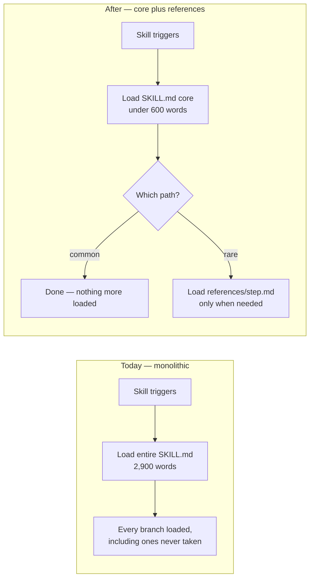
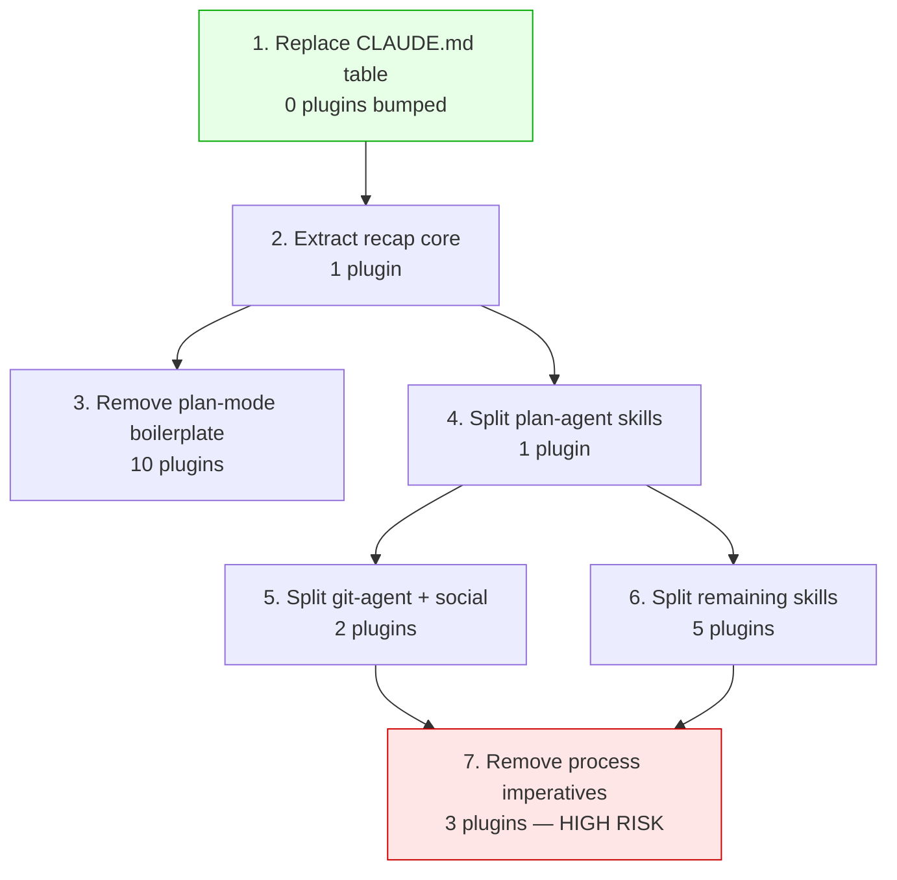

# Context engineering plans for the marketplace plugins

## At a glance

- **Changes shipped:** 7 implementation plans
- **Files touched:** 17 (14 plan files, this session record, the team recap artifact, and the artifacts gallery index)
- **Decisions made:** 6
- **Open items:** 4
- **Plugin code changed:** none

Anthropic published new context-engineering guidance for Claude 5 models. We
measured this repo against all six of its rules, found roughly 33,000 words of
removable context cost across the plugins, and turned the findings into seven
committed implementation plans. Nothing has been implemented yet — every plan is
`status: todo`. The audit numbers are measured from the actual plugin tree, not
estimated.

## What changed

### A measured context audit of all 13 plugins

**Who it affects:** teammates who maintain any plugin.
**What is different now:** we have real numbers instead of impressions about
where context is being wasted, and each number names the files responsible.

Key measurements:

| What | Measured |
|---|---|
| SKILL.md files | 59, totalling 81,367 words |
| Skills over 1,200 words shipping as ONE file | 17, about 28,000 words |
| Files repeating the same plan-mode preamble | 52, about 2,750 words |
| Identical lines shared by `eng-recap` and `team-recap` | 168 lines / 1,568 words |
| Always-loaded context (`CLAUDE.md` + `.claude/rules/`) | 3,590 words |
| Hard constraints in `plan-agent/build` alone | 34, in 2,907 words |

**How to reach it:** the numbers live in the Context section of each plan under
`docs/plans/`.

### Seven implementation plans, committed

**Who it affects:** whoever picks up the work next.
**What is different now:** the audit is executable. Each plan carries steps with
per-step verification, falsifiable acceptance criteria, a runnable objective
test, and an end-to-end verification section.

**How to reach it:** `docs/plans/*.md` for the specs, matching `.html` for the
rendered pages. Commit `999ac6d`.

### A stale project rule flagged

**Who it affects:** anyone reading the marketplace contribution rules.
**What is different now:** `.claude/rules/marketplace.md` line 49 tells
contributors "There is no CI version guard." That is false — both
`scripts/check-plugin-versions.mjs` and
`.github/workflows/check-plugin-versions.yml` exist and run on pull requests.

**How to reach it:** filed as a separate background task, not fixed here.

## How it works now

### What splitting a skill actually changes

The point of the three splitting plans. Today a skill's whole body is loaded the
moment it triggers; there is no partial load. Compare the two shapes:

The concrete case: `plan-agent/build` carries a 60-line "author a plan first"
branch that fires only when no plan is named, yet costs full tokens on every
single invocation.

### Why the plans are sequenced this way

Plans are ordered by blast radius, because this repo requires a version bump for
every plugin touched. A plan spanning ten plugins produces ten bumps in one
commit — hard to review, all-or-nothing to revert.

Plan 4 runs before 5 and 6 to prove the splitting pattern on one plugin first.
Plan 7 runs last because it removes safety constraints and needs the others
settled underneath it.

## Before and after

| Rule | How the plugins are written today | What the plans change it to |
|---|---|---|
| Where detailed guidance lives | Inside the skill body, loaded in full on every trigger | In `references/*.md`, loaded only when that step runs |
| Repeated instructions | The same plan-mode preamble in 52 files | One canonical line, documented once as the pattern |
| Three recap commands | Each restates the whole shared workflow | One shared core file plus three short framing briefs |
| Repo-level context | A 13-row plugin table with paragraph-long rows | One line per plugin, pointing at the generated table |
| Hard constraints | 34 in a single skill, mixing safety with process reminders | Safety guards kept; process reminders dropped |
| Proof a change is safe | "Looks fine" | A committed baseline test that fails if behavior moves |

## Decisions

**Split the work by blast radius, not by topic.** The obvious grouping was one
plan per recommendation. Rejected: this repo requires a `marketplace.json`
version bump for every plugin touched, so topic-grouping produces unreviewable
commits. Blast radius happens to correlate with risk here, so cheap mechanical
work also lands first.

**Write all five recommendations as plans, including the risky one.** The
alternative — dropping the imperative-pruning plan as poor risk-to-return — was
offered and declined. It ships with a mandatory baseline-capture step first and
an explicit abort condition: if a pruned skill's baseline test fails and the
cause is not obvious in one attempt, restore the imperative rather than debug.

**Split the skill-splitting work into three plans by plugin.** The alternative
was one plan with a step per plugin, which avoids repeating the rationale three
times. Rejected in favour of three independently revertible units, grouped into
near-equal thirds (10,776 / 9,758 / 10,545 words).

**Reduce the plan-mode guard, do not remove it.** Two of the article's rules
point at deleting the repeated preamble entirely. Rejected for write-heavy
skills: a skill that starts writing inside plan mode violates a standing user
preference, and that failure is silent. The tutorial goes; the one-line guard
stays and is tested for.

**Keep plan 1 small rather than padding it to match the others.** Plan 1 has 5
steps against 9 for plans 4–7. The work genuinely is small. The repo's own
right-sizing guidance says a chore should not carry a Context essay it does not
need.

**Use a multi-agent workflow for the last four plans.** Requested explicitly.
Eight agents ran — one author plus one adversarial verifier per plan — in about
nine minutes with no errors. The verify stage earned its cost (see Learnings).

## Learnings

**A verification command can be real, reproducible, and still meaningless.** A
first-draft plan carried the check `ls kit/plugins/code-testing-agent/skills/*/references/ | wc -l`
with an expected count. With multiple directories, `ls` emits `dir:` headers and
blank lines, so it prints 14 for a directory holding 4 reference dirs. The number
is stable and entirely unrelated to what the step claimed to measure. It would
have passed review *and* execution. Fixed to `ls -d ...*/references | wc -l`.

This is the strongest argument for the baseline-first sequencing in plan 7: a
plan full of plausible-looking verification is exactly the condition under which
removing safety constraints goes wrong quietly.

**Adversarial verification caught defects, not polish.** Across four plans the
verifiers found: a manifest path that does not exist
(`kit/plugins/plan-agent/plugin.json` — the real one is under `.claude-plugin/`),
a misquoted rule ("refactor = MINOR" is not a row in `marketplace.md`), a claim
that a split "breaks nine assertions" in a test where only three checks touch the
moved content, and line citations past the end of a 204-line file.

**Our own conventions are enforced by hooks and scripts, not by prose.** Writing
a plan file named `trim-...` was rejected instantly by a `PostToolUse` hook whose
verb allowlist has no `trim`. That is Rule 2 of the article in miniature — a
well-designed interface constrains behavior better than an instruction does. It
also suggests imperative-pruning is safer than it looks, but only where a hook or
test already covers the same ground.

**Tried and abandoned: a naive "do all cited paths exist?" check.** It flagged 60
missing files across the four workflow-authored plans. All but one were files the
plans *propose to create*, correctly declared `(new)` in their Files sections; the
last was the checker's own regex matching a substring of a longer valid path. The
check was the bug.

**zsh does not word-split unquoted variables.** A loop over a space-separated
plan list treated the whole string as one filename. Cost one wasted command;
fixed with a proper array.

## Open items

**Nothing is implemented.** All seven plans are `status: todo`. The commit adds
planning documents only — no plugin, skill, or config file changed.

**Plan 7 may be worth dropping.** It has the smallest token return (5 skills) and
the highest regression risk of the set. If the baseline harness proves more
expensive than the saving it protects, abandoning it is a legitimate outcome —
this is stated inside the plan itself.

**Plans 4–6 run about 3x the length of plans 1–3** (3,228–4,048 words against
1,035–1,367). Partly justified by covering more skills, but they are also more
granular than the repo's right-sizing guidance calls for. Not a defect; worth
knowing before reading them side by side.

**The stale `marketplace.md` CI-guard claim is unfixed**, filed as a separate
task rather than folded into this branch.

## Files touched

**Plans — specs (source of truth, edited by hand):**

- `docs/plans/replace-claude-md-plugin-table.md` — cut the repo's always-loaded plugin table
- `docs/plans/extract-recap-command-core.md` — deduplicate the three recap commands
- `docs/plans/remove-exitplanmode-boilerplate.md` — reduce the repeated plan-mode preamble across 52 files
- `docs/plans/split-plan-agent-skills.md` — split `plan-agent`'s five monolithic skills
- `docs/plans/split-git-social-skills.md` — split six skills in `git-agent` and `social-media-tools`
- `docs/plans/split-remaining-plugin-skills.md` — split six skills across five remaining plugins
- `docs/plans/remove-skill-process-imperatives.md` — prune process constraints, baselines first

**Plans — rendered pages (generated, never hand-edited):**

- `docs/plans/*.html` — seven files, produced by `build-plan-html.mjs`

**Outside the plans tree:**

- `docs/plans/sessions/add-context-engineering-plans-session.md` — this record, holding the recap's republish URL
- `docs/artifacts/team-recap-2026-07-27-2.html` — the published team recap
- `docs/artifacts/index.html` — artifacts gallery, rebuilt to card the new recap
- `docs/plans/index.html` — plans gallery, rebuilt so the seven new plans are reachable

## Glossary

**Progressive disclosure** — loading detail only at the moment it is needed,
rather than everything up front. The central idea behind the splitting plans.

**SKILL.md** — the instruction file that defines a skill. Its entire contents are
loaded whenever the skill activates; there is no partial load.

**Monolithic skill** — a skill whose SKILL.md ships as a single file with no
supporting reference files, so every branch costs tokens on every invocation.

**Blast radius** — how many plugins a change touches, and therefore how many
version bumps and how large a revert it implies.

**`marketplace.json`** — the registry listing every plugin and its version. Any
edit to a plugin requires raising its version here.

**Version bump** — raising a plugin's version number so installers receive the
change. Required by repo convention for any plugin edit.

**Always-loaded context** — files read at the start of every session
(`CLAUDE.md`, `.claude/rules/`), paid whether or not they are relevant.

**Tautology check** — deliberately breaking the thing a test protects, confirming
the test fails, then reverting. Proves the test detects regressions rather than
passing unconditionally.

**Tier 1 / Tier 2** — whether a plan changes application code (Tier 1) or only
docs and metadata (Tier 2). Determines how much testing the plan must specify.

**verb-target filename** — the naming convention for plan files
(`replace-claude-md-plugin-table`), enforced automatically by a hook with an
allowlist of imperative verbs.

**Republish key** — a URL stored in a session record's frontmatter so re-running
a command updates the existing published page instead of minting a new link.
