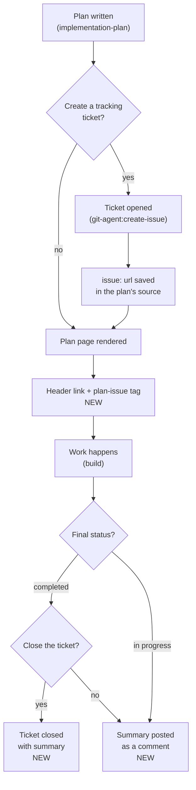

# Plans and their tracking tickets, linked end to end

## At a glance

- Changes shipped: 3
- Files touched: 15
- Decisions recorded: 6
- Open items: 3
- Commits: 2 (`e2e39c4`, `40e5817`) on `claude/create-ticket-prompt-order-579ee3`
- Plugin version: `plan-agent` 7.2.0 → 7.4.0

A plan could already have a tracking ticket, but the connection went one way and
then stopped. The ticket's URL was written into the plan's source file and never
appeared on the plan people actually read, and finishing a plan did nothing to
the ticket. Three changes close that loop: the ticket question is asked first,
the link is rendered onto the plan, and completing a plan offers to close the
ticket with a summary.

## What changed

### 1. The ticket question comes first

**Who it affects:** anyone generating a plan with `/plan-agent:implementation-plan`.

At the end of plan generation, two questions are asked in a single prompt: "create
a tracking issue?" and "what next — implement, review, exit?". The issue was
already created before the next-step choice was acted on, but it was asked
second. The order in the prompt now matches the order things happen.

**How to reach it:** the last prompt of `/plan-agent:implementation-plan`.

### 2. A plan shows its ticket

**Who it affects:** anyone opening a plan page.

A plan's source file can carry an `issue:` key — written either when the plan was
generated from an existing ticket, or when a ticket was created for it. That key
was preserved in the source and dropped on the way to the HTML page, so a
finished plan gave no hint which ticket belonged to it. The page now carries a
link in its header, labelled `Issue #<number>`, plus a machine-readable
`plan-issue` tag other tools can read.

**How to reach it:** open any plan whose source has `issue: <url>`. Plans without
one are unchanged, down to the byte.

### 3. Finishing a plan updates the ticket

**Who it affects:** anyone marking a plan done, and everyone watching the ticket.

Both places that mark a plan completed — the `build` skill's completion gate and
the `finalize-plan` skill — now act on that link. A summary is written first
(plan filename, final status, criteria checked, and every completion-report note
verbatim), and then:

- Plan finished → you are asked whether to close the ticket. On yes, it is closed
  with the summary attached.
- Plan came up short and landed back at *in progress* → the ticket is never
  closed. The same summary is posted as a comment so the ticket shows where the
  work stopped.

**How to reach it:** `/plan-agent:finalize-plan <plan>`, `/plan-agent:finalize-plan --all`,
or the completion gate at the end of `/plan-agent:build`.

## How it works now

The whole loop, from a plan being written to its ticket being closed. The two new
edges are the link reaching the rendered page, and completion reaching the
tracker.

## Before and after

| Situation | Before | Now |
|---|---|---|
| Order of the two end-of-plan questions | Next step first, ticket second | Ticket first, next step second |
| A plan whose source has `issue:` | URL kept in the source, invisible on the page | Header link plus a `plan-issue` tag on the page |
| A plan with no `issue:` | — | Renders exactly as before, byte for byte |
| Ticket URL ending in a number | — | Link reads `Issue #512` |
| Ticket URL with no trailing number | — | Link reads `Tracking issue` |
| Plan marked completed | Ticket untouched | You are asked; on yes it is closed with a summary |
| Plan downgraded to in progress | Ticket untouched | Never closed; summary posted as a comment |
| Sweeping many plans at once (`--all`) | — | One ticket question for the whole sweep, not one per plan |
| Tracker tool missing or not signed in | — | One line reported, plan still completes |

## Decisions

**Ride the existing prototype-link path instead of building new plumbing.**
Plans already had a source key (`prototype:`) that becomes a page tag and a
header link. The ticket link reuses that exact shape. *Why it matters:* both are
emitted only when the key exists, so plans without a ticket produce identical
output — which is what keeps the existing check that re-renders all 84 committed
plans green. *Rejected:* a dedicated metadata block on the page, and a ticket
badge on the plans gallery — both change output for plans that have no ticket.

**Closing asks; commenting does not.** Closing a ticket is visible to everyone
watching it and changes its state; a comment only adds information. *Rejected:*
closing automatically on completion — the plan's author is not always the ticket's
owner.

**A plan that lands *in progress* is never closed, but is still updated.** The
comment is the honest signal: the ticket stays open, and it now says where the
work stopped. *Rejected:* silence, which leaves the ticket looking untouched.

**The rule is written into both completion skills, not referenced from one.**
`build` and `finalize-plan` each own "mark this plan completed", and the codebase
already flags that the two must be kept consistent by hand. Skills load
independently, so a cross-reference would not be read. *Consequence:* the test
asserts every clause against both files and names whichever one is missing it —
landing the rule in only one place is the real failure mode.

**A failed tracker command never blocks completion.** The plan's status is already
decided by the time the ticket is touched. *Rejected:* treating an unreachable
tracker as a completion failure.

**Version bumped as a feature, twice.** 7.2.0 → 7.3.0 for the rendered link,
7.3.0 → 7.4.0 for the completion behavior — new behavior is a minor bump under
this repo's rules.

## Learnings

**The renderer exists in two copies and a test enforces they match.** The
canonical one is `scripts/`; a bundled copy ships inside the plugin, and a check
compares them byte for byte. Editing one and not the other fails with a "re-copy
it" message rather than anything about the actual change.

**A temp directory name leaked into the output and faked a passing test.** The
new test created its sandbox with the prefix `plan-issue-link-`, and the renderer
writes project paths into the page — so the assertion "this page contains no
`plan-issue` tag" was matching the directory name instead. Renaming the prefix to
`ticket-link-` fixed it. Any assertion of the form "output does not contain X"
is worth checking against the scaffolding that produced the output.

**One diverged behavioral baseline was noise.** The repository has a check that
runs several skills headlessly and compares structural facts about what they
wrote. It reported 4 of 5 matching; a full re-run reported 5 of 5, and a third
run after the `build` skill was edited also reported 5 of 5. These runs involve a
live model, so a single divergence is worth re-running before it is worth
investigating.

**Prose line-wrapping broke a literal-string test.** Two contract assertions
failed only because the phrases they searched for were split across lines in the
skill file. The fix was to rewrap the sentences, not to loosen the test — a test
that tolerates arbitrary wrapping stops asserting the phrase.

## Open items

**No live test that a ticket actually closes.** The closure behavior is
instructions the model follows, and the test asserts those instructions exist in
both skills — not that a real ticket changes state. A test against a throwaway
repository would close that gap.

**The GitLab command pairing is unverified.** The GitHub path uses one command
with a comment flag; GitLab needs a comment then a close, and that pairing has
not been run against a real GitLab remote.

**The plans gallery still shows no ticket.** Prototypes get a marker on the
gallery card; tickets do not. Deliberately skipped — adding one changes the
gallery output for every plan.

## Files touched

**Plan rendering (both copies, kept byte-identical)**

- `scripts/lib/plan-shell.mjs` — emits the `plan-issue` tag and the header link
- `scripts/build-plan-html.mjs` — reads the `issue:` key, derives the link label
- `kit/plugins/plan-agent/scripts/lib/plan-shell.mjs` — bundled copy
- `kit/plugins/plan-agent/scripts/build-plan-html.mjs` — bundled copy

**Skills**

- `kit/plugins/plan-agent/skills/implementation-plan/SKILL.md` — ticket question asked first; notes that the key now renders
- `kit/plugins/plan-agent/skills/build/SKILL.md` — ticket update added to the completion gate
- `kit/plugins/plan-agent/skills/finalize-plan/SKILL.md` — new ticket step covering both edit modes and the `--all` sweep
- `kit/plugins/plan-agent/skills/implementation-plan/guidelines/section-catalog.md` — `issue:` documented as rendered, no longer listed as inert

**Tests**

- `tests/plugins/test-plan-issue-link.mjs` — new; 3 checks on the rendered link and its absence
- `tests/plugins/test-plan-ticket-closure.sh` — new; 8 checks, each asserted against both completion skills

**Docs and metadata**

- `kit/plugins/plan-agent/README.md` — describes the link and what completion does with it
- `kit/plugins/plan-agent/CHANGELOG.md` — 7.3.0 and 7.4.0 entries
- `.claude-plugin/marketplace.json` — version 7.4.0

## Glossary

**Plan spec** — the Markdown source file for a plan. It is the thing that gets
edited; the HTML page people read is generated from it.

**Frontmatter** — the block of `key: value` lines at the top of the spec.
`issue:` is one of those keys.

**Renderer** — the script that turns a plan spec into its HTML page.

**Meta tag** — an invisible line in a page's header holding a value for other
tools. `plan-issue` is the one added here.

**Skill** — a set of instructions a Claude Code plugin ships, which the model
follows when the matching task comes up. `build` and `finalize-plan` are skills.

**Completion gate** — the checks a plan must pass before it can be marked
completed.

**Downgrade rule** — the existing rule that sends a plan back to *in progress*
when some acceptance criteria are still unchecked.

**Sweep mode** — `finalize-plan --all`, which finalizes many plans in one run.

**`gh` / `glab`** — GitHub's and GitLab's command-line tools.

**Behavioral baseline** — a recorded set of structural facts about what a skill
does when run headlessly, compared against a fresh run to catch changes in
behavior.

**Worktree** — a second checkout of the same repository, on its own branch. This
session ran in one.
