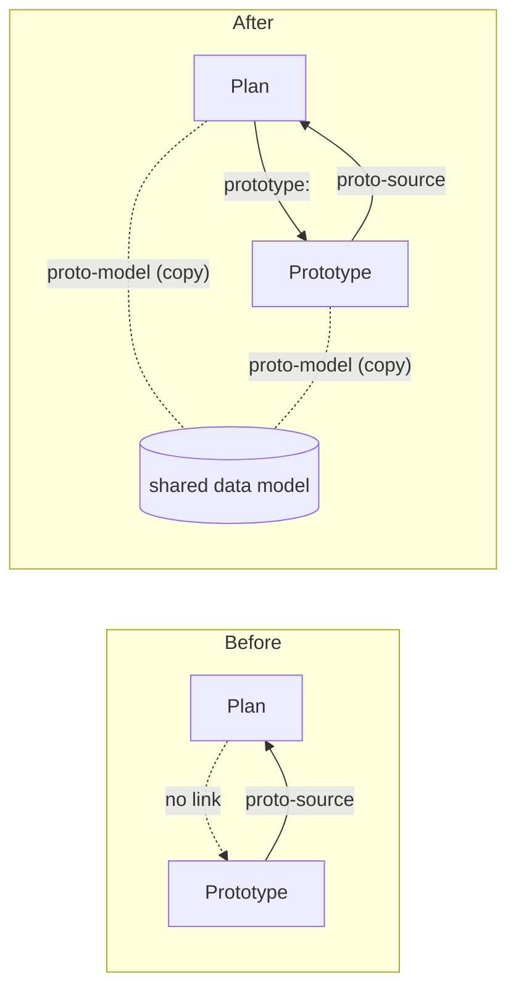
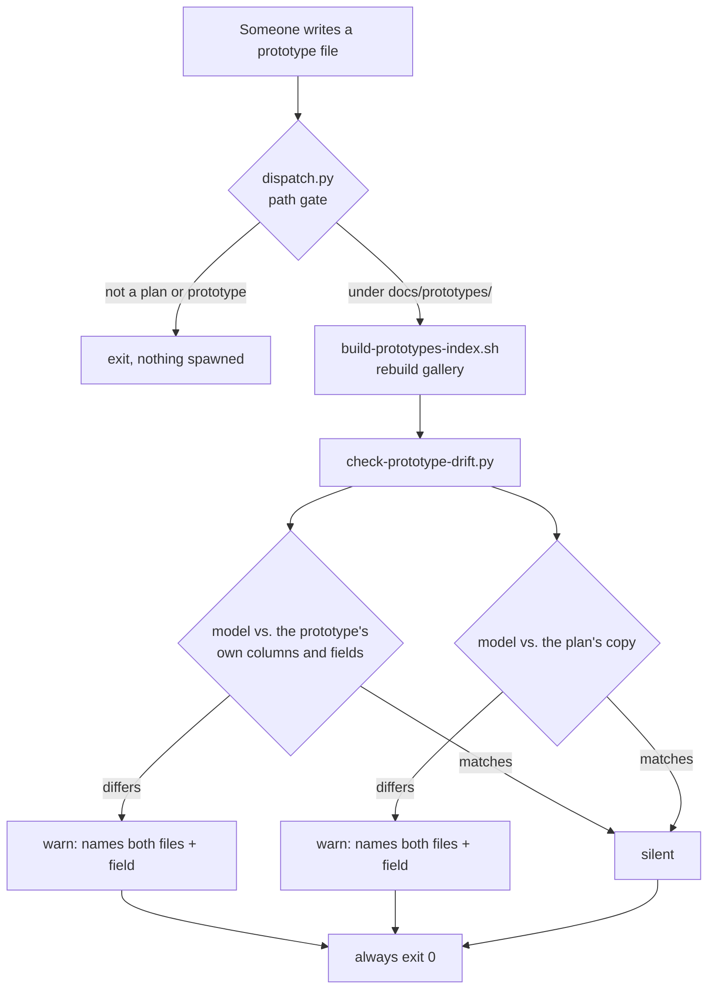
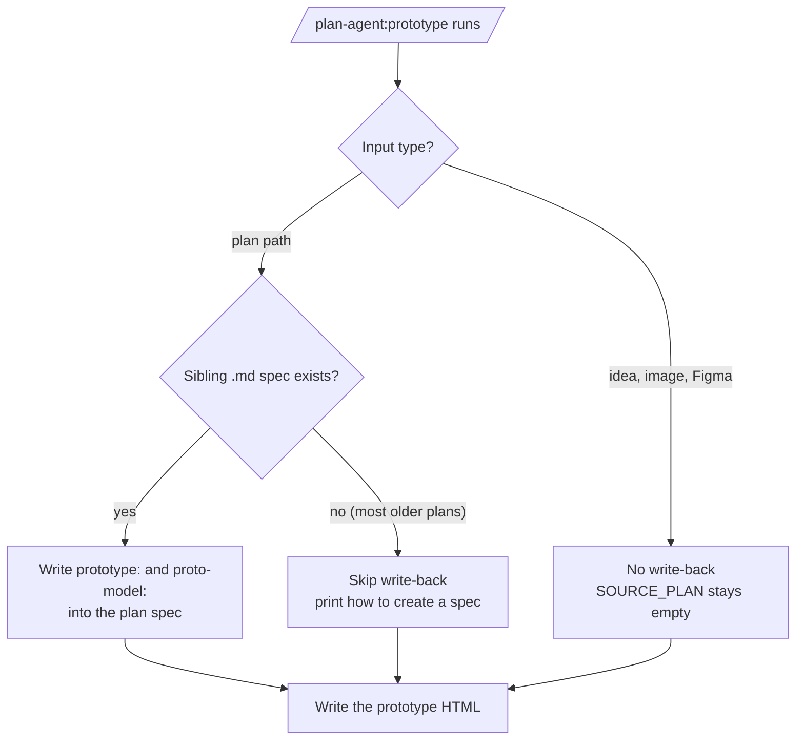

# Plan and prototype linking with drift detection

## At a glance

- **Changes shipped:** 6
- **Files touched:** 21 (+1105 / −85)
- **Decisions recorded:** 6
- **Open items:** 4
- **Tests added:** 3 files, 54 assertions
- **Status:** shipped as [PR #465](https://github.com/shawn-sandy/agentics/pull/465); plan marked `completed`

We made a plan document and its clickable prototype point at each other, and
added an automatic check that notices when the two have quietly fallen out of
sync. Before this, a prototype knew which plan it came from but the plan had no
idea a prototype existed — and neither file wrote down the data model they
supposedly shared, so nothing could tell you they had diverged. The work was
verified end-to-end (full test suite, a hand-built fixture pair, and a real
browser click) before the plan was marked complete.

One genuine bug surfaced during the manual verification walk that the automated
tests had missed, and it was fixed and regression-tested.

## What changed

### 1. A plan now links to its prototype

**Who it affects:** anyone reading a plan — engineers and non-engineers alike.

A plan whose spec carries a `prototype:` line now shows a **View prototype**
link in its header, next to the effort and status badges. Clicking it opens the
prototype. The plan page also gains a hidden marker (`plan-prototype`) that the
plans gallery reads.

**How to reach it:** add `prototype: docs/prototypes/<slug>.html` to a plan's
Markdown spec and re-render.

### 2. The gallery shows which plans have a prototype

**Who it affects:** anyone browsing the plans gallery.

The plans gallery card gains a small **prototype** chip. It is a text label, not
a second link — the whole card is already one big link, and nesting a link
inside a link is invalid HTML that browsers silently pull apart.

### 3. Both files now record the shared data model

**Who it affects:** nobody directly today; it is what makes the drift check
possible.

The prototype generator worked out a data model (the thing being tracked, its
fields and their types, the main action, and the signal that proves it works)
and then threw it away once the page was built. That model is now written into
both files as a single line of machine-readable data.

### 4. A new hook reports drift

**Who it affects:** whoever edits a prototype by hand.

`check-prototype-drift.py` runs automatically whenever a prototype is written.
It compares the recorded model against the prototype's own visible columns and
form fields, and against the plan's copy of the model. When they disagree it
prints a warning naming both files, the field that differs, and what to re-run.

**How to reach it:** it runs on its own. Nothing to invoke.

### 5. The prototype generator writes the link back

**Who it affects:** anyone running `/plan-agent:prototype` against a plan.

The skill now writes `prototype:` and `proto-model:` into the source plan before
writing the prototype. When the plan has no Markdown spec (most older plans are
HTML-only), it skips the write-back, still builds the prototype, and prints one
line explaining how to create a spec.

### 6. `{{SOURCE_PLAN}}` became a real contract

**Who it affects:** future maintainers of the prototype skill.

That placeholder was undefined free text that only ever fed a display string. It
is now pinned: the repo-relative path of the plan's Markdown spec on the plan
path, and empty for idea, image, and Figma inputs. The drift check resolves the
owning plan from it, so without a format contract the whole comparison would be
unimplementable.

## How it works now

*The link used to run one way only. Now both files point at each other and both
carry a copy of the same data model — which is the part that makes drift
detectable.*

*The drift check is the last child to run and always exits 0 — a report about
one plan must never block work on another.*

*The write-back is deliberately conditional: 69 of 84 committed plans are
HTML-only, and creating a spec as a side effect would rewrite a file nobody
asked us to touch.*

## Before and after

| | Before | After |
|---|---|---|
| Finding a plan's prototype | No way to know one existed | **View prototype** link in the header; chip on the gallery card |
| The shared data model | Derived, then discarded | Recorded in both files as one line of JSON |
| A hand-edited prototype | Nobody notices | Warning naming both files and the diverging field |
| Prototype link path | — | Computed relative to the plan's own folder, so a custom or nested plans folder still resolves |
| Plan with no prototype | — | Renders byte-for-byte identically to before this change |
| Running against an HTML-only plan | — | Prototype still built, no spec created, one-line notice printed |
| Drift check exit code | — | Always 0, on every input including missing files and malformed data |

## Decisions

**Detection, not two-way sync.** Plan-to-prototype is regeneration (re-run the
generator); prototype-to-plan is detection (compare and report).
*Rejected:* full bidirectional sync. Prototypes have no separate source file, so
the HTML *is* the source — pushing a prototype edit back into plan prose would
need an HTML-to-model parser over generated files, which the repo's conventions
forbid.

**The header link ships no new CSS.** It uses the existing link color and the
header row's spacing.
*Rejected:* a styled button. The shared stylesheet is copied into every plan, so
one new rule would change the bytes of all 84 existing plans and break the
"a plan without a prototype renders identically" requirement. Flagged in the PR
as reversible if the team prefers the button.

**The gallery chip is a text label, not a link.** The card is already wrapped in
a link, and a nested link is invalid HTML that browsers silently unnest.
*Rejected:* an icon-only chip — it gives screen-reader and voice-control users
no signal that a prototype exists.

**The link path is computed, never hard-coded.** A fixed `../prototypes/` would
resolve to the wrong folder for any plan stored outside the default location.
*Rejected:* the hard-coded path, on the grounds that the plans folder is
configurable and can nest.

**The drift check always exits 0.** Every other hook in this plugin does, and the
dispatcher would treat a non-zero exit as something the user must fix.
*Rejected:* blocking on drift — a report about some other plan interrupting
whatever you are actually doing is worse than the drift.

**The written data must stay on one line.** The plan's frontmatter reader is a
simple line scanner; an embedded line break or stray separator would silently
truncate the block and corrupt the plan's status and creation date for every
tool that reads it.

## Learnings

**A test fixture can be too clean to catch a bug.** The drift check read field
names straight out of the prototype's HTML. The page template contains an
authoring comment that includes a literal example attribute — `data-field="key"`
— and that comment ships into every generated prototype. So the check reported a
field called `key` that did not exist, on a file that had not drifted at all.

The automated test missed it entirely, because its fixture was a hand-written
minimal page rather than the real template. The manual verification walk caught
it on the first run.

Two fixes, both kept: strip HTML comments before scanning, and point the test
fixture at the **real** template so this class of bug cannot hide again.

**The general lesson:** when you scan HTML with pattern matching, comments,
script bodies, and attributes all look the same. And a fixture that is simpler
than production is a fixture that cannot reproduce production's bugs.

**Every new assertion was mutation-checked.** Each was confirmed to fail when the
behaviour it covers is deliberately reverted — five checks, five caught. A test
that passes both before and after a fix is not a test.

**Two test failures were environment artifacts, not bugs.** On macOS the
temporary folder is a symbolic link, and the renderer derives paths relative to
the current folder — so an unresolved path produced absurd output. Resolving the
temp path fixed it. Worth knowing before chasing a phantom.

## Open items

**`tests/pages/test-pages-smoke.sh` fails** — confirmed pre-existing and
unrelated by stashing all changes and re-running on a clean tree. Not
investigated; someone should.

**Three acceptance criteria are specified but not executed.** The write-back, the
HTML-only-plan notice, and the `proto-source` value are all behaviour of the
prototype generator, which is a set of instructions for an AI agent rather than
executable code. The plan itself acknowledges no committed test can assert these.
Each instruction was confirmed present and unambiguous; the generator was not
run.

**A moved, renamed, or deleted prototype goes unnoticed.** The link and chip
assume the target still exists. Nothing currently checks.

**A hand-edited plan desyncs silently.** Detection runs one direction only —
prototype against plan. Accepted deliberately: plans are human-written prose, not
generated output.

## Files touched

**The linking itself (both copies must stay identical)**
- `scripts/build-plan-html.mjs` + `kit/plugins/plan-agent/scripts/build-plan-html.mjs` — read the `prototype:` key, compute the relative link
- `scripts/lib/plan-shell.mjs` + `kit/plugins/plan-agent/scripts/lib/plan-shell.mjs` — emit the marker tag and the header link

**The gallery (three identical copies)**
- `scripts/build-plans-index.sh`, `kit/plugins/plan-agent/hooks/build-index.sh`, `docs/plans/build-index.sh` — the prototype chip
- `kit/plugins/plan-agent/templates/plans-gallery.html` — chip styling

**The drift check**
- `kit/plugins/plan-agent/hooks/check-prototype-drift.py` — new; the whole comparison
- `kit/plugins/plan-agent/hooks/dispatch.py` — run it after the gallery rebuild

**The prototype generator**
- `kit/plugins/plan-agent/skills/prototype/SKILL.md` — pinned the source-plan contract, added the model output and the write-back step
- `kit/plugins/plan-agent/skills/prototype/reference/PROTOTYPE-SKELETON.html` — the model block

**Tests**
- `tests/plugins/test-prototype-plan-link.mjs` — new; the end-to-end check
- `tests/plugins/test-prototype-drift.sh` — new; 10 hook branches plus dispatcher fan-out
- `tests/plugins/test-build-plan-html.mjs` — the "renders identically without a prototype" check, which renders through the previous version of the renderer and compares

**Docs and metadata**
- `kit/plugins/plan-agent/README.md`, `kit/plugins/plan-agent/CHANGELOG.md`, `.claude-plugin/marketplace.json` — documentation and the 4.3.1 → 4.4.0 bump
- `docs/plans/add-prototype-plan-linking.md` / `.html`, `docs/plans/index.html` — plan marked complete and re-rendered

## Verification

| Check | Result |
|---|---|
| End-to-end test (`test-prototype-plan-link.mjs`) | 5 passed |
| Drift hook test (`test-prototype-drift.sh`) | 14 passed |
| Renderer test (`test-build-plan-html.mjs`) | 35 passed |
| Prototypes gallery test | passed |
| Full plugin suite (37 files) | 0 failing |
| Publish and demo suites | 0 failing |
| Version guard | exit 0, plan-agent at 4.4.0 |
| File-copy parity | all identical |

Also walked by hand: built a matching plan/prototype pair, rendered it, opened
the plan in a browser and clicked the link (it reaches a working prototype, and
the new data block does not break the prototype's own behaviour), then ran the
three-stage drift walk — matching pair stays silent, one renamed field produces
two warnings naming both files, and removing the plan's copy silences the plan
comparison.

## Glossary

- **Plan** — a document describing work to be done. Written as Markdown (the
  editable source) and rendered to HTML (what people read).
- **Prototype** — a single self-contained clickable HTML page generated from a
  plan, so you can try the data shapes and flow before building anything.
- **Spec** — the Markdown source of a plan. Older plans have only the rendered
  HTML and no spec.
- **Frontmatter** — the block of `key: value` lines at the top of a Markdown
  file, between two `---` markers.
- **Drift** — when two files that are supposed to describe the same thing no
  longer agree.
- **Hook** — a script the tooling runs automatically when a file is written.
- **Dispatcher (`dispatch.py`)** — the single hook that checks a file's path once
  and then decides which other hooks to run, instead of every hook waking up on
  every edit.
- **Skill** — a set of instructions an AI agent follows. Instructions, not code,
  which is why some behaviour cannot be covered by an automated test.
- **Data model** — the shape of the thing being tracked: its name, its fields and
  their types, the main action, and the signal that proves it works.
- **Mutation check** — deliberately breaking the code to confirm the test
  actually fails, proving the test is real.
- **Byte-identical** — two files matching exactly, character for character. Used
  here to prove existing plans were not disturbed.
- **Plans gallery** — the browsable index page listing every plan as a card.
