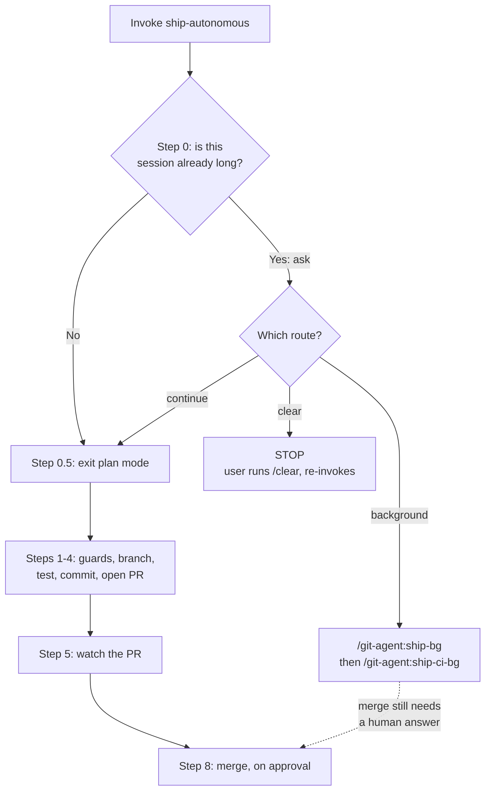
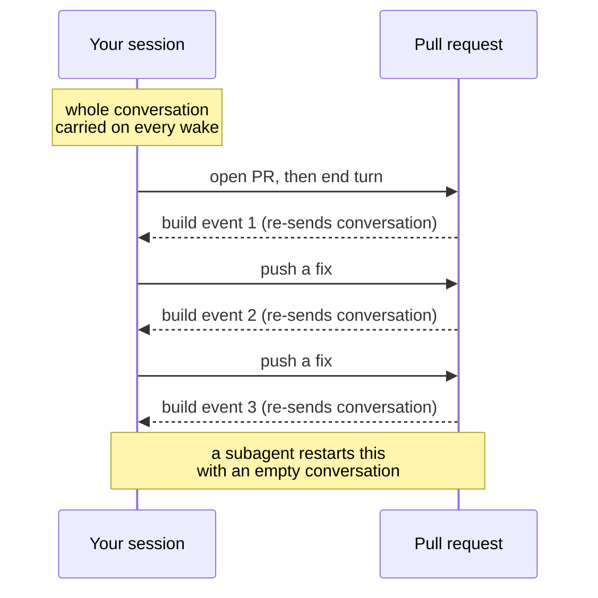

# Context guard for the ship-autonomous pipeline

## At a glance

| Changes shipped | Files touched | Decisions made | Open items |
|---|---|---|---|
| 5 | 5 | 6 | 4 |

`ship-autonomous` — the git-agent skill that commits, opens a pull request, and
then watches the build until it is safe to merge — now opens by checking whether
it is running inside a long conversation, and offers two cheaper ways to run
before it touches anything. The pipeline never reads the conversation, so all
that accumulated history is cost with no benefit, and the cost repeats on every
build event.

Nothing is committed yet. Five files sit in the working tree, all verified: a
new 12-check test passes, one deliberate sabotage of the skill text made the
right check fail, and the existing git-agent test suite and the version guard
both still pass.

## What changed

### 1. The pipeline asks before spending your conversation

**Who it affects:** anyone who runs `/git-agent:ship-autonomous`.

Previously the skill started working immediately. Now its first step states that
it reads all of its inputs from `git` and `gh` (the GitHub command-line tool) and
none from the conversation, then — only if the conversation is already long —
offers three routes:

- **clear** — you run `/clear` and re-invoke. Nothing is lost.
- **background** — run `/git-agent:ship-bg` then `/git-agent:ship-ci-bg`
  instead. Each of those dispatches a subagent, which gets its own fresh
  conversation, and your session stays free for other work.
- **continue** — run here anyway.

**How to reach it:** it fires on its own the next time you invoke the skill from
a long session. On a short session you will not see it.

### 2. The `clear` route stops rather than pretending

**Who it affects:** nobody directly — it is a correctness guarantee.

The skill cannot clear its own context. If it tried and silently failed, it
would run the whole pipeline inside exactly the bloated session you asked to
escape. So choosing `clear` ends the run and hands back to you.

### 3. A skip condition, so it is not a prompt on every run

**Who it affects:** anyone shipping from a fresh session.

The guard exists to catch an expensive default, not to add friction. If the
session is short, or was started for this ship, the step is skipped silently.

### 4. A test that pins the guard's own justification

**Who it affects:** the next person to edit this skill.

`tests/plugins/test-ship-autonomous-context-guard.sh` — 12 checks. The important
one asserts the skill text literally still says "No step reads the conversation."
If somebody later adds a step that *does* read the transcript and updates that
sentence, the test fires, because clearing context would no longer be safe.

**How to reach it:**

```bash
bash tests/plugins/test-ship-autonomous-context-guard.sh
```

### 5. Version and changelog

**Who it affects:** anyone installing git-agent from the marketplace.

`git-agent` goes 4.7.0 → 4.8.0 in `.claude-plugin/marketplace.json`, with a
matching CHANGELOG entry. Minor, not patch: this adds behavior.

## How it works now

The new Step 0 sits ahead of everything, including the plan-mode exit that used
to be first.



*What to look at: the three arrows out of "Which route?" — only `continue` goes
straight on, and the background route still comes back for the merge approval.*

The second diagram is the reason the guard exists. Step 5 deliberately ends the
turn and waits for build events; each event that wakes the session re-sends the
entire conversation as input.



*What to look at: the cost is per event, not per run — so it multiplies by how
many times the build fails.*

## Before and after

| Before | After |
|---|---|
| The skill started working the moment it was invoked. | It checks the session length first and offers cheaper routes. |
| Nothing pointed at the background commands, so people did not use them. | The `background` route names both commands in order. |
| The plan-mode exit was Step 0. | It is Step 0.5. Every other step number is unchanged. |
| The README walkthrough listed 10 steps. | It lists 11, with the guard first. |
| `git-agent` was at 4.7.0. | 4.8.0. |
| No test covered the skill's opening. | 12 checks, including step ordering and the safety claim. |

## Decisions

**Add the guard as text in the skill, not as new machinery.** Five options were
weighed. Rejected: a new `agent-ship-autonomous` subagent plus a
`/ship-autonomous-bg` command (two new files, and it loses the merge approval
gate, because a subagent has no user to ask); a `UserPromptSubmit` hook (a new
Python file that still cannot clear context — the same redirect with more
parts); and simply relying on habit, with nothing in the product to enforce it.
The chosen option is one edit to one file, and its content points at the two
background commands that already exist.

**The `clear` route hard-stops.** A skill has no way to clear its own context.
Continuing after a no-op would defeat the entire purpose.

**Skip the guard on a short session.** A prompt on every run would be friction
paid by everybody to protect against a case that only some runs hit.

**Insert as Step 0 and demote the old Step 0 to Step 0.5, rather than
renumbering.** The skill's later steps cross-reference each other by number
about a dozen times ("return to Step 6", "Step 8 blocks on this"). Renumbering
would have touched all of them. The file already used a half-step (Step 2.5), so
this matches its own convention. Rejected: a full renumber, for the blast radius.

**Merging still comes back to the foreground.** The background route ends at the
merge gate on purpose. Rejected: letting a subagent merge — the existing
`agent-merge` already does exactly that when you want it, and folding it in here
would remove a human decision from an irreversible action.

**Minor version bump, not patch.** No new command or skill was added, but the
skill behaves differently. Patch was rejected as understating it.

## Learnings

**A grep-based test can be tautological, so one was deliberately broken.** The
STOP-on-`clear` assertion was the subtle one, so the clause was deleted from the
skill, the suite re-run (check 8 failed, as intended), and the file restored
(all 12 passed again). A passing grep only proves the text is present; the
mutation proves the grep is load-bearing.

**The shell tool's working directory persists between calls.** A `chmod` failed
with "No such file or directory" because an earlier compound command had left
the shell inside `kit/plugins/git-agent`. Absolute paths avoid the whole class of
problem.

**Markdown renumbers ordered lists by position, but the source still matters.**
Inserting a step into the README left two literal `3.` entries. It renders
correctly and reads wrong, so the remaining items were renumbered with a small
script rather than by hand.

## Open items

**Nothing is committed.** Five files are in the working tree. They need a
commit, a branch, and a pull request.

**The new test is not wired into CI.** The workflows in `.github/workflows/`
name individual test scripts one by one — `check-plugin-versions.yml` and
`publish-dist.yml` each list a handful — and the new script is in neither. It
runs only when someone runs it. Adding it to `check-plugin-versions.yml`
alongside the other git-agent tests is the obvious follow-up.

**"Is this session long?" is a judgment call, not a measurement.** There is no
tool that reports the current context size, so the guard relies on the model
assessing its own conversation. How reliably it does that across models is
untested.

**No `ship-autonomous-bg` was built, deliberately.** If one-command unattended
shipping is wanted later — and a report-instead-of-merge ending is acceptable —
that is the change to make.

## Files touched

### The skill

- `kit/plugins/git-agent/skills/ship-autonomous/SKILL.md` — new Step 0 context
  guard; the former Step 0 (exit plan mode) is now Step 0.5.

### Documentation

- `kit/plugins/git-agent/README.md` — the ship-autonomous walkthrough now opens
  with the guard, and the numbered list was re-sequenced 1–11.
- `kit/plugins/git-agent/CHANGELOG.md` — v4.8.0 entry covering the guard, the
  three routes, why no new agent was added, and the test.

### Tests

- `tests/plugins/test-ship-autonomous-context-guard.sh` — new, 12 checks. Step
  ordering, the no-session-context claim, all three routes, the STOP guarantee,
  the skip condition, `allowed-tools`, and README sync.

### Marketplace

- `.claude-plugin/marketplace.json` — `git-agent` 4.7.0 → 4.8.0.

## Glossary

- **ship-autonomous** — the git-agent skill that runs the whole delivery
  pipeline: branch, test, commit, open a pull request, watch the build, fix
  common failures, and merge once you approve.
- **Context / conversation** — everything said so far in a session. It is re-sent
  to the model on every turn, so a long session costs more per turn than a short
  one.
- **Subagent** — a separate assistant dispatched to do one job. It starts with an
  empty conversation and reports back, so its work does not add to yours.
- **Step 0.5** — a half-numbered step. This skill already used Step 2.5;
  half-steps let a step be inserted without renumbering the ones that other
  steps refer to by number.
- **`gh`** — GitHub's official command-line tool. The pipeline uses it to open
  pull requests and read build status.
- **CI** — continuous integration; the automated build and test run that fires on
  every push to a pull request.
- **marketplace.json** — the registry at the repository root listing every
  plugin and its version. Editing a plugin requires bumping its version here.
- **Mutation test** — deliberately breaking the code (or, here, the text) under
  test to confirm the test actually fails. Guards against tests that pass no
  matter what.
- **`allowed-tools`** — the frontmatter line in a skill file listing which tools
  it may use. Omitting one causes a permission prompt in the middle of a run.
