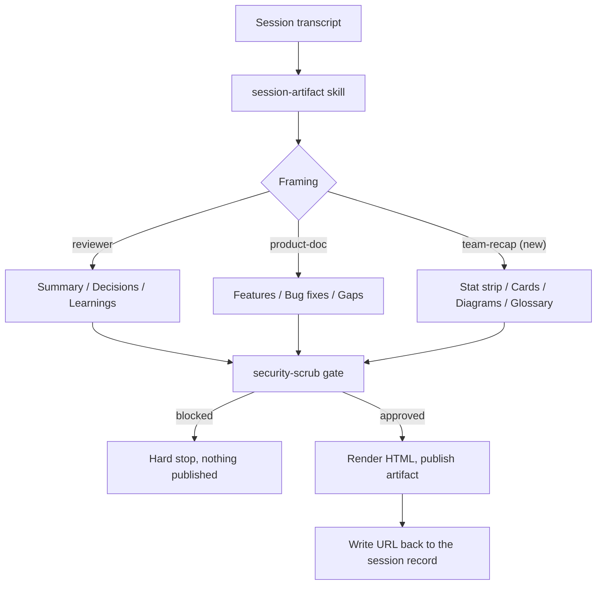
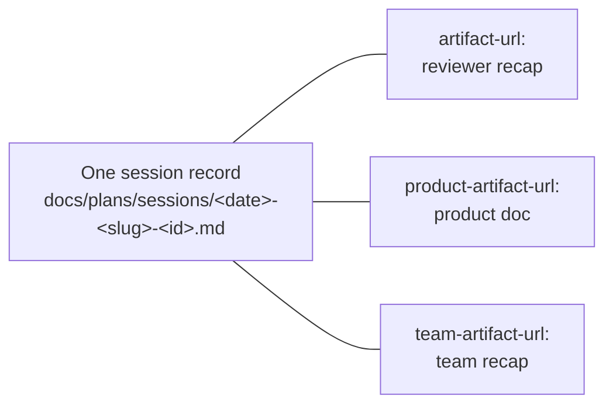

# Team recap command for artifact-tools

## At a glance

| | |
|---|---|
| Changes shipped | 1 new command, 1 new test check |
| Files touched | 5 (1 new) |
| Decisions | 4 |
| Open items | 1 |

The `artifact-tools` plugin gained `/artifact-tools:team-recap`, a command that
turns a Claude Code session into a visual, skimmable page for the whole team —
the engineer picking the work up next and the teammate who only needs to know
what moved. It ships as a thin wrapper over the existing `session-artifact`
skill rather than as new machinery, so the plugin's blocking secret-scan gate
stays in exactly one place. The plugin went from version 1.4.0 to 1.5.0.

## What changed

### `/artifact-tools:team-recap` — a session recap anyone on the team can read

**Who it affects:** anyone who wants to hand a session's outcome to a group with
mixed backgrounds, instead of writing the update by hand twice.

**What is different now:** the plugin previously offered two recap framings —
one for code reviewers (`session-artifact`), one for product and stakeholders
(`/artifact-tools:product-doc`). Neither targets the whole team at once, and
neither asks for anything visual. The new command does both: it produces one
page with an at-a-glance stat strip, a card per change, diagrams of anything
whose shape changed, a before-and-after table, decisions with the options that
lost, learnings, open items, files touched, and a glossary of every internal
term used.

**How to reach it:**

```
/artifact-tools:team-recap                 # newest session
/artifact-tools:team-recap <session-id>    # a specific session
```

### A guard against silently overwriting a published page

**Who it affects:** anyone maintaining the plugin — it prevents a class of bug
that is invisible until a shared link has already gone stale.

**What is different now:** the plugin's smoke test grew a twelfth check
asserting that each of the three recap writers declares its own distinct
republish key. Adding a fourth wrapper by copying an existing one now fails the
test instead of quietly stealing another recap's URL.

## How it works now

The three recap commands share one pipeline. Only the framing differs; the
transcript extraction, the secret-scan gate, the publish step, and the
post-publish verification are written once and reused.



*What to look at: all three framings funnel into the same scrub gate. That is
the reason `team-recap` is a command and not a fourth skill — a new skill would
have meant a second copy of the gate.*

The republish hazard the new test guards is easier to see than to describe. All
three commands read and write the **same** record file for a given session, so
each needs its own key inside it:



*What to look at: three keys, one file. A copied wrapper that forgets to rename
its key republishes over whichever page already owned that key — the link you
shared last week now shows someone else's document.*

## Before and after

| | Before | After |
|---|---|---|
| Recap framings available | Reviewer recap, product/stakeholder doc | Plus a whole-team visual recap |
| Audience assumed | One or the other — engineer or non-engineer | Both, in a single document |
| Visuals in a recap | None specified | Diagrams required where structure or flow changed, and captioned |
| Diagram technology | Not applicable | Mermaid only — the artifact security policy blocks every external script and asset |
| Adding a fourth recap wrapper | Copy an existing one; a duplicated republish key passes tests | Duplicated key fails the smoke test |
| Plugin version | 1.4.0 | 1.5.0 |

## Decisions

**A command wrapping the existing skill, not a fourth skill.** The expensive and
risky parts of a recap — locating the transcript, extracting it without burning
context, the blocking secret scan, publishing, verifying the page rendered — are
already written. A new skill would have duplicated them, and duplicating a
security gate is the specific thing worth never doing. *Rejected:* a standalone
`team-artifact` skill, which would have been roughly four times the code for the
same output.

**Mermaid diagrams, no charting library.** Published artifacts render mermaid
natively, and a strict content security policy blocks external scripts,
stylesheets, fonts, and remote images outright. There was no library option to
weigh — the native feature is also the only one that works.

**Its own republish key, `team-artifact-url:`.** The session record filename is
deterministic per session, so all three commands land on the same file. A shared
key would mean the second command to run republishes over the first one's page.

**The test hardcodes the expected key owners.** The first version of the check
tried to infer, from prose, which key each file "owns" — and failed immediately,
because every file deliberately mentions the other keys in its don't-write
warning. Replacing the inference with a hardcoded map of file to expected key is
shorter, has no parser to maintain, and still fails on the realistic bug.

## Learnings

- **A regex over prose is a parser, and a parser in a test is a liability.** The
  ownership-inference version of the check was written, run, and thrown away
  inside one iteration. The failure was immediate and unambiguous, which is the
  good case; the lesson is that the dumb hardcoded assertion should have been
  the first attempt.
- **A test that has never failed has not been tested.** The new check was
  verified by copying the plugin to a temporary directory, corrupting
  `team-recap.md` so it reused the product key, and confirming the assertion
  fired. Passing on correct input proves nothing on its own.
- **Three plugin variants sharing one state file is a real hazard, not a
  hypothetical one.** It only surfaces after a link has been shared and gone
  stale — which is exactly the kind of bug that needs a mechanical guard rather
  than a note in a document.

## Open items

- **The command has been authored but not yet exercised end to end.** This page
  is the first run of the workflow it describes, and it was executed by hand
  from the command's instructions, because a newly written command file is not
  loaded as a slash command in the session that created it. A fresh session
  should run `/artifact-tools:team-recap` directly to confirm the command
  dispatches, and re-run it to confirm the republish key sends the second
  publish to the same URL rather than minting a new one.

## Files touched

**The command**

- `kit/plugins/artifact-tools/commands/team-recap.md` — new. Audience rules,
  visual constraints, the nine sections, gallery filing, and the republish key.

**The guard**

- `tests/plugins/test-artifact-tools.sh` — added the twelfth check: the three
  recap writers must declare distinct republish keys.

**Plugin metadata and docs**

- `.claude-plugin/marketplace.json` — version 1.4.0 to 1.5.0 (a new command is a
  minor bump under semantic versioning).
- `kit/plugins/artifact-tools/CHANGELOG.md` — the 1.5.0 entry.
- `kit/plugins/artifact-tools/README.md` — features table, usage examples,
  directory tree, and a component section describing the command.
- `CLAUDE.md` — the repository's plugin table now names the command.

## Glossary

- **Artifact** — a self-contained web page published to claude.ai from a
  Claude Code session. Private by default; the author chooses whether to share
  the link.
- **Command** — a plugin component invoked explicitly by name, as
  `/plugin-name:command-name`. Contrast with a **skill**, which activates
  automatically when a request matches its description.
- **Content security policy** — the browser rule set that blocks a published
  artifact from loading anything off an external server. It is why diagrams have
  to be drawn with a built-in feature rather than a downloaded library.
- **Marketplace** — the registry file listing every plugin in this repository
  along with its version, which is what users install from.
- **Mermaid** — a plain-text syntax for diagrams. Published artifacts turn it
  into rendered graphics with no external tooling.
- **Republish key** — a line in a session's saved record holding the URL of an
  already-published page, so re-running a command updates that page instead of
  creating a second one.
- **Scrub gate** — the mandatory secret scan that runs before anything is
  published. A finding stops the publish outright; there is no override.
- **Semantic versioning** — the convention behind 1.4.0 to 1.5.0: the middle
  number rises when something is added, the last when something is fixed.
- **Session record** — the committed Markdown file summarizing a session, kept
  under `docs/plans/sessions/`. It is the durable artifact; the published page
  is rendered from it.
- **Smoke test** — a fast script asserting a component's basic structure is
  intact. This plugin's now runs twelve such checks.
