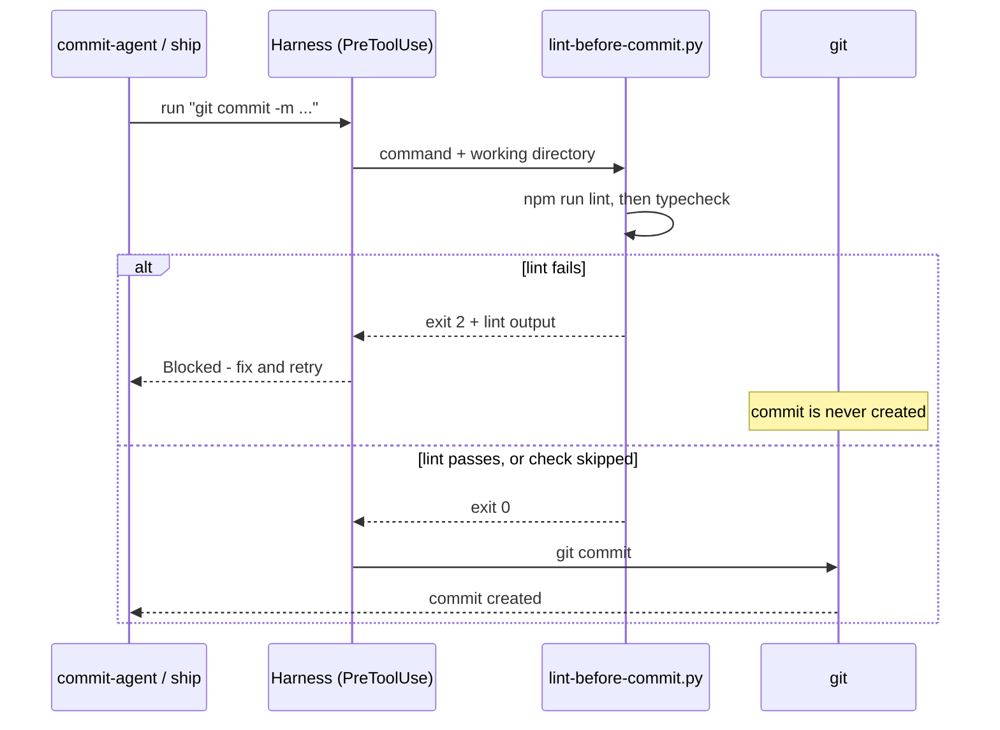
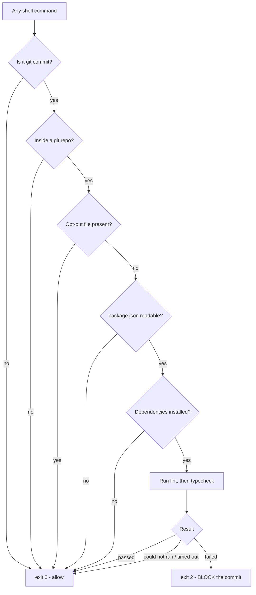

# git-agent's pre-commit lint gate and where it is inert

## At a glance

- **Code changes shipped:** 0 — this was an investigation session
- **Files modified:** 0
- **Files read:** 7
- **Findings verified by test:** 4
- **Decisions:** 3
- **Open items:** 3

Someone asked whether our automated commit helper runs a lint check before it
commits. The short answer is no — the helper itself never runs lint, but a
separate piece of plumbing that ships alongside it does, and it blocks the
commit outright when lint fails. We proved that with a live test rather than by
reading the code.

The finding worth carrying out of this session is the last one: **in this
repository that gate currently does nothing.** It is installed and wired
correctly, but it only knows how to check JavaScript-style projects, and this
repo has no such project file at its root. Every commit here passes it without
any check running.

## What changed

No source files changed this session. What changed is what the team knows —
each card below is a finding, not a code change.

### The commit helper does not run lint itself

**Who it affects:** anyone who assumed `commit-agent` was checking their work.

`commit-agent` and its background twin `agent-commit` contain no lint step at
all. Both say the opposite in plain text — "STOP here. Do not run tests, analyze
coverage, check for issues" ([SKILL.md:71](kit/plugins/git-agent/skills/commit-agent/SKILL.md:71)).
The same is true of `ship`, which states "this skill does not run tests"
([SKILL.md:241](kit/plugins/git-agent/skills/ship/SKILL.md:241)) and only mentions
lint as text it writes into a pull request's Test Plan.

**How to reach it:** `kit/plugins/git-agent/skills/commit-agent/SKILL.md`

### A hook does run lint, one layer down

**Who it affects:** everyone who commits in a repo with `git-agent` installed.

The check lives in a hook — a script the harness runs automatically before a
tool call, without the skill knowing about it. It watches every shell command,
recognizes `git commit`, and runs the project's `lint` script (then `typecheck`)
before allowing the commit through. On failure it stops the commit and hands the
lint output back so the assistant can fix and retry with no user round-trip.

**How to reach it:** `kit/plugins/git-agent/hooks/lint-before-commit.py`,
registered in `kit/plugins/git-agent/hooks.json`

### The gate is confirmed working — tested, not just read

**Who it affects:** teammates who need to trust the gate.

We fed the hook four real payloads and recorded its exit codes. A failing lint
plus a `git commit` returned exit 2 and blocked the commit; the three
"should-not-block" cases all returned 0. Details in *Before and after* below.

**How to reach it:** the test fixture is described under *Open items*.

### In this repository the gate is inert

**Who it affects:** everyone committing to `agentics` — though nothing is broken
by it today.

The hook detects projects by reading `package.json` at the repository root.
This repo has none, so the hook exits immediately without running anything.
Every commit here — through `commit-agent`, through `ship`, or typed by hand —
passes the gate with no check performed. That is the intended fail-open
behaviour for a Markdown-and-JSON repository, but it means "the lint gate is
installed" and "commits here are lint-checked" are two different claims, and
only the first is true.

**How to reach it:** confirmed by running the hook against this repo's root.

### The gate belongs to the plugin, not to this project

**Who it affects:** anyone installing `git-agent` into another repository.

Both halves ship inside the plugin directory, so the gate travels with the
plugin to every repo that installs it. This project's own `.claude/settings.json`
registers a separate, non-overlapping set of hooks (merge-driver setup,
default-branch sync, marketplace JSON validation, an uncommitted-plans warning,
and a version-bump guard) and contains no lint hook at all.

**How to reach it:** `kit/plugins/git-agent/hooks.json` versus `.claude/settings.json`

## How it works now

### Where the gate sits

The skill never calls lint. It asks to run `git commit`, and the harness
intercepts that request and consults the hook first. Look at the left branch:
the commit is never created at all, rather than created and then reverted.

### How the hook decides

Every path except one ends in "allow". Only a check that actually ran and
actually found something is permitted to block — the branch marked BLOCK is the
sole exit that stops a commit.

## Before and after

What the team assumed at the start of the session, against what the test
actually showed.

| Assumed | Actually true |
|---|---|
| The commit helper runs lint | It does not; a hook shipped beside it does |
| Only `commit-agent` is covered | Any `git commit` is covered, including `ship`, background agents, and hand-typed commits |
| A lint failure produces a commit you then fix | The commit is never created — the tool call is blocked before git runs |
| "Gate installed" means "commits are checked" | Only where a root `package.json` exists; here it is a silent no-op |
| The gate is part of this project's config | It ships with the `git-agent` plugin and travels to every repo that installs it |
| A command containing the word "commit" would trip it | `git log --grep commit` passes cleanly; the pattern anchors on the real subcommand |
| Disabling it requires editing the plugin | Create `.claude/no-lint-gate` at the repo root |

The four cases we actually ran:

| Case | Exit code | Outcome |
|---|---|---|
| Failing lint, `git commit` | 2 | Blocked, with the lint output returned |
| Failing lint, `git log --grep commit` | 0 | Allowed — not a commit |
| Passing lint, `git commit` | 0 | Allowed |
| Failing lint, opt-out file present | 0 | Allowed — opt-out honoured |

## Decisions

### Verify with a purpose-built fixture instead of reading the script

**Why:** the user asked for confirmation that lint runs before a commit. Reading
the code establishes intent, not behaviour, and this hook has enough
fall-through conditions that intent and behaviour can differ.

**Rejected — reason through the source and report:** would have produced a
confident answer that was wrong for this repository, since nothing in the script
text announces that it no-ops without a `package.json`.

**Rejected — run a real commit here and observe:** proves nothing. It would have
passed, and passed for the wrong reason — no check ran.

### Report this repo's no-op as a headline, not a footnote

**Why:** "the gate is installed and working" is true and misleading in the same
breath. A teammate acting on it would believe their commits here are checked.

**Rejected — lead with the passing test matrix and mention the caveat at the
end:** technically complete, but buries the one fact that changes behaviour.

### Leave the test fixture in place rather than deleting it

**Why:** removing it needs `rm`, which this project requires explicit approval
for. The fixture sits in a session-isolated scratchpad and harms nothing.

**Rejected — delete it automatically as cleanup:** the first attempt did exactly
this and was correctly blocked. See *Learnings*.

## Learnings

- **The permission guard caught a destructive command mid-task.** The first
  fixture build opened with `rm -rf` on the target directory — routine scripting
  habit — and was denied. Rebuilding with `mkdir -p` against a fresh directory
  name worked identically. Reflex `rm -rf` in a setup script is a habit worth
  dropping in this repo.
- **A lint fixture needs a `node_modules` directory to exist, even an empty
  one.** The hook treats a missing dependency directory as "not installed yet"
  and exits before running anything, so a fixture without it silently tests the
  wrong path and looks like a pass.
- **The command pattern is more careful than it first appears.** `git log --grep
  commit` contains the literal word and is correctly ignored; the pattern also
  excludes `commit-tree`, which a plain word-boundary match would have caught by
  mistake.
- **Exit code 2 is the specific contract that makes this a gate.** In this hook
  position, 0 permits the call and 2 blocks it while routing the message back to
  the assistant. Any other non-zero code surfaces as a hook error and lets the
  commit through — which is why the script deliberately returns 0 on every
  condition it does not positively understand.
- **The gate's placement tracks the cost of being wrong.** Committing is cheap
  and local, so a passive hook is enough. Merging is public and hard to undo, so
  the `merge` skill re-runs lint explicitly rather than trusting that the
  commit-time hook ever ran — and reports the gate as *skipped* when its
  preconditions do not hold, rather than as passed.

## Open items

- **Decide whether the inert gate here is intentional.** This repo has no root
  `package.json`, so the lint gate never runs. If lint coverage for the
  Markdown, JSON, and Python files here is wanted, it needs a different
  mechanism — the current hook only understands JavaScript-style projects.
  Nothing is broken today; this is a question, not a defect.
- **The `typecheck` path was never exercised.** Only the `lint` script was
  tested. The hook runs `typecheck` second using the same logic, so it is
  expected to behave identically, but that is inference rather than evidence.
- **Test fixture left on disk.** Four files under the session scratchpad at
  `.../scratchpad/lintfix1`, including a `package.json` with a deliberately
  failing lint script. Session-isolated and harmless; removal needs `rm`, which
  was not approved.

## Files touched

**No files were modified this session.** All repository access was read-only.
Files examined, grouped by area:

### The lint gate itself

- `kit/plugins/git-agent/hooks.json` — confirmed the hook registration, its event
  and its matcher
- `kit/plugins/git-agent/hooks/lint-before-commit.py` — the full decision path,
  detection logic, and exit-code contract

### Skills checked for a lint step

- `kit/plugins/git-agent/skills/commit-agent/SKILL.md` — confirmed no lint step
- `kit/plugins/git-agent/agents/agent-commit.md` — confirmed no lint step
- `kit/plugins/git-agent/skills/ship/SKILL.md` — confirmed lint appears only as
  PR text, never as a command
- `kit/plugins/git-agent/README.md` — the contrasting behaviour of `merge` and
  `ship-autonomous`, which do run lint directly

### Project configuration

- `.claude/settings.json` — confirmed the project registers no lint hook of its
  own
- `kit/plugins/git-agent/.claude-plugin/plugin.json` — confirmed the hook ships
  with the plugin

### Created outside the repository

- `<scratchpad>/lintfix1/` — throwaway test repository; see *Open items*

## Glossary

- **git-agent** — the plugin in this marketplace that automates git work:
  creating branches, writing commits, opening pull requests, merging.
- **commit-agent** — the part of `git-agent` that writes a commit message and
  commits. The subject of the original question.
- **ship** — the part of `git-agent` that commits, pushes, and opens a pull
  request in one go.
- **merge** — the part of `git-agent` that checks whether a pull request is ready
  and merges it. Unlike the others, it runs lint directly.
- **Hook** — a script the harness runs automatically around tool calls. It runs
  whether or not the assistant knows it exists, which is why it can enforce a
  rule that a written instruction cannot.
- **PreToolUse** — the hook event that fires *before* a tool call runs, so the
  hook can block the call. The lint gate uses this; the project's own hooks use
  `PostToolUse`, which fires after and cannot block.
- **Exit code** — the number a script returns when it finishes. Here, 0 means
  allow and 2 means block.
- **Fail-open** — a design where anything unrecognized is allowed through rather
  than blocked. Chosen here because the hook runs on every shell command in
  every repo that installs the plugin, so a false block would be far more
  disruptive than a missed check.
- **package.json** — the file that defines a JavaScript project and its named
  scripts, including `lint`. The hook's only detection mechanism.
- **node_modules** — the directory holding a JavaScript project's installed
  dependencies. Its absence tells the hook the project is not set up yet.
- **Lint / typecheck** — automated checks for, respectively, code style and
  likely mistakes, and type correctness.
- **Working tree** — the files as they currently sit on disk, including edits not
  yet committed.
- **Scratchpad** — a temporary directory scoped to one session, used for files
  that should not enter the repository.
