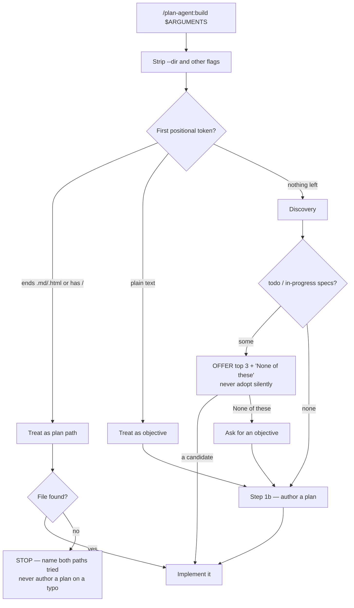
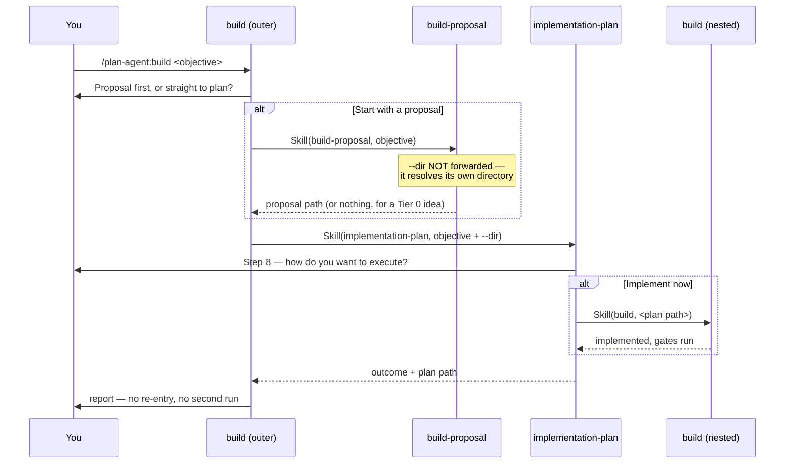

# build can now author the plan it implements — PR #470

## At a glance

- **Changes shipped:** 8
- **Files touched:** 10
- **Decisions recorded:** 7
- **Open items:** 5
- **Tests:** 9 → 18
- **State:** merged 2026-07-27 · `plan-agent` 4.4.0 → **5.0.0** (major)

`/plan-agent:build` used to stop and tell you to go make a plan first. Now, when
you run the command without naming one, it walks you through making that plan —
proposal, plan, review — and then implements what comes back. The second half of
the change is a safety fix: when you ran `build` bare, it used to quietly pick
up whatever unfinished plan it happened to find. It now shows you the candidates
and asks.

Nothing about the assistant's automatic behaviour changed. The new chain is
reachable only when you type the slash command yourself.

## What changed

### 1. `build` with no plan now makes one

**Affects:** anyone running `/plan-agent:build`.
**What's different:** the command no longer dead-ends. It asks whether to start
from a proposal or go straight to plan authoring, hands off to the skill that
owns each stage, and implements the plan that comes back.
**How to reach it:** `/plan-agent:build` with no arguments.

### 2. You can hand `build` an objective instead of a file

**Affects:** anyone running `/plan-agent:build`.
**What's different:** the command accepts free text. The first word decides how
the argument is read — a path if it ends in `.md`/`.html` or contains a `/`,
otherwise an objective.
**How to reach it:** `/plan-agent:build add a health check endpoint`.

### 3. Breaking — bare `build` asks instead of assuming

**Affects:** anyone who relied on the old silent pickup.
**What's different:** a single unfinished plan used to be adopted with no
prompt. It is now presented as an option, alongside `None of these — author a
new plan`. The offer shows at most three candidates and states how many were
hidden, because the question widget renders at most four choices.
**How to reach it:** `/plan-agent:build` in a repo with existing `todo` plans.

### 4. Breaking — new argument format

**Affects:** scripts or notes that document the old shape.
**What's different:** `[<plan.md|plan.html>] [--dir <path>]` became
`[<plan.md|plan.html>] [<objective>] [--dir <path>]`. Flags are stripped before
anything is classified, so `--dir tmp/plans` on its own is still a bare `build`,
not an objective named `--dir`.

### 5. The uncommitted-work check moved to the front

**Affects:** anyone with a dirty working tree.
**What's different:** the check used to sit just before implementation. On a
chained run that meant crossing a whole proposal loop and plan interview before
being asked about files you already had open. It now runs first — and it ignores
the plan's own spec, its rendered HTML, and any proposal the chain just wrote,
since those are not pre-existing work.

### 6. The model is pinned for the implementation stage

**Affects:** nobody directly; it prevents a silent quality drop.
**What's different:** `model: opus` is now declared on the `build` skill. A
skill's model override lasts the rest of the turn and does not unwind when the
skill ends, so without the pin a chained run would write source code on whatever
model the last planning skill happened to declare.

### 7. Every gate has a defined answer when it cannot ask

**Affects:** headless and automated runs.
**What's different:** when the question tool is unavailable, every gate stops
and reports the choice it would have offered. It never picks for you.

### 8. Test coverage doubled

**Affects:** contributors to `plan-agent`.
**What's different:** `tests/plugins/test-build-skill.sh` went from 9 checks to
18, covering the chain, the discovery offer, guard ordering, and the argument
grammar. Each check was proven load-bearing by reverting the step it guards and
confirming it fails.

## How it works now

### Argument routing

Which of the three inputs you give the command decides everything downstream.
Follow the `no positional token` and `objective` branches — those are the ones
that are new.

### The authoring chain, and why it can call itself

Step 1b delegates rather than re-implements. Note the loop: the plan skill's own
"what next" menu calls `build` back, and that nested run is the one that writes
the code. The outer chain then reports its result and stops.

## Before and after

| Situation | Before | After |
|---|---|---|
| `build` with no plan named | Stopped, told you to run `implementation-plan` | Enters the authoring chain: proposal → plan → review → implement |
| `build` with exactly one unfinished plan | Adopted it silently | Offers it, alongside "author a new plan" |
| `build` with many unfinished plans | Asked, unbounded list | Offers the newest three and states how many were hidden |
| `build` with a free-text objective | Read as a plan path, then failed | Skips discovery, goes straight to authoring |
| Objective whose first word contains `/` | Bare list of paths tried | Stop message names the misparse and says to reword |
| `build` with a mistyped plan path | Fell through to discovery, could implement a different plan | Stops and names both paths it tried |
| HTML-only legacy plan | Stopped | Still stops — needs its spec reconstructed, not a new plan on top |
| Uncommitted files present | Asked just before implementing | Asked first, before any authoring; plan artifacts excluded |
| Model during implementation | Inherited from the last planning skill | Pinned to Opus |
| Question tool unavailable | Undefined — resolved inconsistently | Every gate stops and reports the options |
| Ambient ("build the plan in X") | Requires an existing plan | Unchanged, byte-identical description |

## Decisions

**The chain is delegation, not re-implementation.**
Step 1b makes real `Skill()` calls to `build-proposal` and `implementation-plan`.
*Rejected:* copying their logic into `build`, which would have produced a second
plan-authoring implementation to keep in sync with the first.

**Re-entrancy is allowed, and made safe by re-resolving the plan by path.**
`implementation-plan`'s Step 8 already calls back into `build`, so a chained run
enters `build` twice. *Rejected:* a re-entry flag or guard. Resolving the
produced spec by its path lets the existing completed/resume preconditions do
the deciding, with no new state to get wrong.

**`Implement now` at the nested menu is terminal for the outer chain.**
`Skill()` is synchronous, so by the time control returns, the nested run has
already finished. *Rejected:* continuing the outer run — it would ask whether to
redo work that just completed, or restart a run the user deliberately stopped.
This overrode two rows in the original proposal's appendix.

**The chain is reachable only from the slash command, not ambient activation.**
The `description` frontmatter is byte-identical to `main`. *Rejected:* widening
the trigger to catch "build a todo app" — the same widening also catches "build
fails on CI" and "build the docker image". The word is too overloaded.

**Two no-plan branches deliberately still stop.**
A named-but-missing path, and an HTML-only legacy plan. *Rejected:* chaining on
both. Authoring an entire plan because of a typo is worse than stopping, and a
legacy plan needs its spec reconstructed rather than a new plan written over it.

**`--dir` is forwarded to plan authoring but not to proposal writing.**
It names where the *plan* goes; `build-proposal` resolves its own proposals
directory. This was corrected during review — the first pass withheld it from
both, which would have written the spec to the default directory and then failed
to find it on return.

**The discovery offer is capped at three.**
`AskUserQuestion` renders at most four options, and one slot is reserved for
`None of these`. *Rejected:* an unbounded list, which would not render at all.

## Learnings

A pull request carries no record of what was tried and abandoned, so this
section is thin by construction. Two items survived into the PR description
because they were found by running the skill rather than reading it:

- The gates had no stated behaviour when `AskUserQuestion` is unavailable. Two
  headless runs resolved the same missing tool in opposite directions — one
  stopped at the proposal gate, the other adopted the lone discovery candidate,
  which is the exact silent pickup this release exists to remove.
- The documented misparse example was wrong. The rule tests the leading token
  only, so `add A/B testing support` parses cleanly as an objective; only a
  slash in the *first* token misreads the argument as a path.

## Open items

- **Four acceptance criteria are asserted statically only.** Criteria 2, 8, 9,
  and 10 — chain entry when no specs exist, the objective prompt on the
  `None of these` path, and the two Step 8 terminations — need an interactive
  session that no harness here can drive. Recorded in the plan's Completion
  Report at [docs/plans/add-plan-authoring-to-build.md](../add-plan-authoring-to-build.md).
- **Test assertions check presence, not always ordering.** An automated reviewer
  noted that check 10 would pass if `implementation-plan` appeared before
  `build-proposal`, and check 13 accepts `status: todo` and `Implement now`
  anywhere in the section rather than scoped to the Exit/workflow clauses. Check
  11 already does the offset comparison; 10 and 13 do not. Non-blocking, not
  addressed.
- **A rendered-HTML formatting glitch.** In the completion report,
  `Exit — I'll implement later` is split across a `<dt>`/`<dd>` boundary,
  leaving mismatched backticks in
  [docs/plans/add-plan-authoring-to-build.html](../add-plan-authoring-to-build.html)
  around line 1808. Cosmetic.
- **The plugin metadata could say more.** A reviewer suggested `plugin.json` and
  `marketplace.json` describe the no-plan behaviour explicitly. The marketplace
  description was updated; `plugin.json` carries only `name` and `description`
  by repo convention.
- **CodeRabbit never completed a review.** Its run reports "Review failed — the
  pull request is closed"; the PR merged before it finished.

## Files touched

### The change itself

- [kit/plugins/plan-agent/skills/build/SKILL.md](../../../kit/plugins/plan-agent/skills/build/SKILL.md)
  — the whole behaviour change: new Step 1b chain, rewritten Step 1 resolution,
  hoisted dirty-tree guard, `model: opus` pin, new `argument-hint`, and `Skill`
  added to `allowed-tools`. +163 lines.

### Tests

- [tests/plugins/test-build-skill.sh](../../../tests/plugins/test-build-skill.sh) — 9 new
  static checks (9 → 18) covering the chain, the offer, guard ordering, and the
  argument grammar. +174 lines.

### Plugin metadata and docs

- [.claude-plugin/marketplace.json](../../../.claude-plugin/marketplace.json) — version
  4.4.0 → 5.0.0 and a description mentioning the no-plan behaviour.
- [kit/plugins/plan-agent/.claude-plugin/plugin.json](../../../kit/plugins/plan-agent/.claude-plugin/plugin.json)
  — metadata touch-up.
- [kit/plugins/plan-agent/CHANGELOG.md](../../../kit/plugins/plan-agent/CHANGELOG.md) —
  the 5.0.0 entry, including the two breaking changes.
- [kit/plugins/plan-agent/README.md](../../../kit/plugins/plan-agent/README.md) — the new
  command behaviour and objective-only usage.
- [CLAUDE.md](../../../CLAUDE.md) — the repo-level plugin table row for `plan-agent`.

### Plan record

- [docs/plans/add-plan-authoring-to-build.md](../add-plan-authoring-to-build.md)
  — marked `completed`, with the Completion Report and verification notes.
- [docs/plans/add-plan-authoring-to-build.html](../add-plan-authoring-to-build.html)
  — the re-rendered plan.
- [docs/plans/index.html](../index.html) — gallery card and count.

## Glossary

- **plan-agent** — the plugin that owns the plan lifecycle: authoring, review,
  implementation, and follow-through.
- **build** — the plan-agent skill that implements a plan: walks its steps, ticks
  the spec, re-renders it, and runs the completion gates.
- **implementation-plan** — the skill that authors a plan. It ends with a Step 8
  menu asking how to execute.
- **build-proposal** — the skill that turns a rough idea into a decision-complete
  proposal document before any plan exists.
- **Step 1b** — the new section of `build` holding the no-plan authoring chain.
- **Step 8** — the menu at the end of `implementation-plan`: `Implement now`,
  `Exit — I'll implement later`, `Run as workflow`.
- **spec** — the Markdown plan file. It is the source of truth; the HTML is a
  render of it.
- **discovery** — `build` scanning the plans directory for specs whose `status:`
  is `todo` or `in-progress`.
- **ambient / model invocation** — the assistant activating a skill on its own
  from the wording of a request, as opposed to you typing the slash command.
- **`AskUserQuestion`** — the tool that renders a multiple-choice prompt. It
  displays at most four options.
- **Tier 0 idea** — one `build-proposal` judges small enough to answer directly,
  producing no proposal document.
- **dirty working tree** — uncommitted changes present in git.
- **`--dir`** — the flag overriding which directory plans are read from and
  written to.
