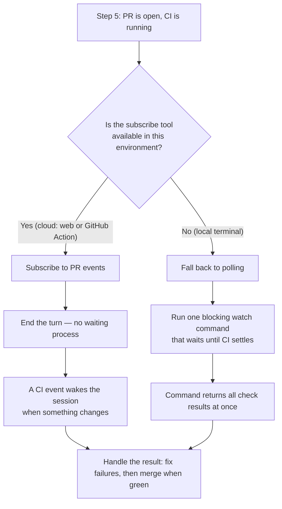
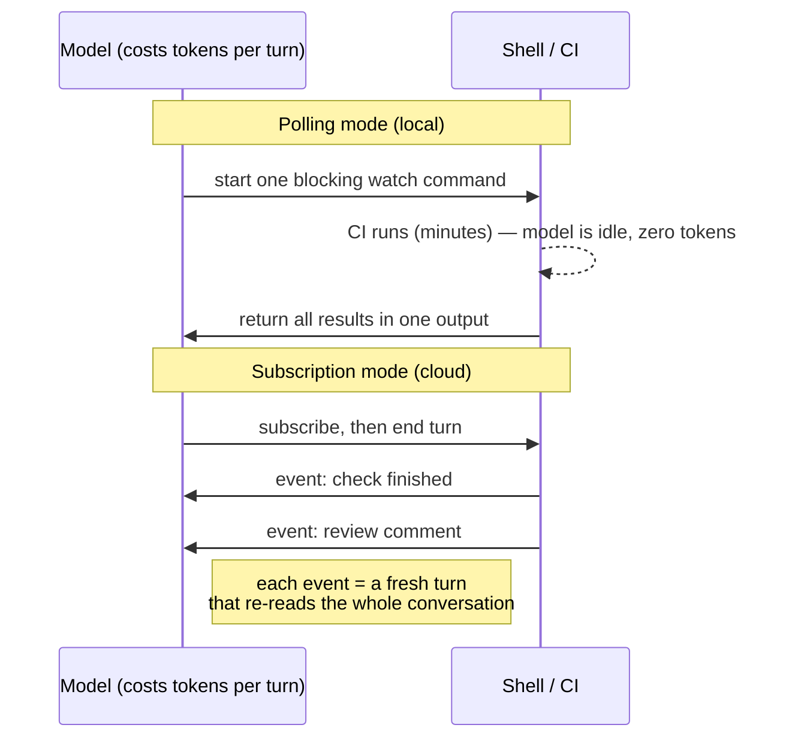

# Why ship-autonomous falls back to CI polling locally

## At a glance

- **Code changes shipped:** 0 — this was a diagnostic session
- **Files read:** 1 (`ship-autonomous/SKILL.md`)
- **Findings documented:** 2
- **Recommendations:** 1 (leave the watch command as-is)
- **Open items:** 1 (an optional, unadopted optimization)

Someone ran the automated "ship" workflow on their own laptop and saw a message
saying it had fallen back to "synchronous CI polling." Nothing was broken — that
fallback is by design. This session explains **why** it happens (the live-update
capability only exists in cloud environments) and, as a follow-up, **whether
polling costs more tokens** (it does not, in the way people expect). No code was
touched; the deliverable is the understanding itself.

## What changed

Nothing in the repository changed. Both items below document how existing
behavior works, so the next person who sees the message — or worries about its
cost — has the answer without re-deriving it.

### Finding 1 — Local runs poll CI; only cloud runs get live updates

- **Who it affects:** anyone running the ship workflow from a local terminal.
- **What's different now:** we can explain the "falling back to synchronous CI
  polling" message instead of treating it as an error. The preferred path
  (subscribe to pull-request events) needs a tool that exists only in remote
  environments — Claude Code on the web or a GitHub Action. On a laptop that
  tool is absent, so the workflow correctly uses the fallback: poll the checks
  until they finish.
- **How to reach it:** run `/git-agent:ship-autonomous`. To get the live-update
  path instead, run the same workflow from Claude Code on the web or inside a
  GitHub Action.

### Finding 2 — Polling does not burn tokens the way it sounds like it would

- **Who it affects:** anyone weighing the cost of shipping locally.
- **What's different now:** we can state the real cost model. The waiting itself
  is free — the workflow waits inside a single blocking command, and no model
  thinking happens while it waits. The token cost comes only from the *output*
  that command produces and from any fix-and-recheck loops, not from the passage
  of time.
- **How to reach it:** relevant every time `ship-autonomous` watches CI locally;
  no action required.

## How it works now

### The Step 5 decision: subscribe, or poll

Follow the branch. The left path only exists in the cloud; a laptop always takes
the right path.

### Why "waiting" is free but "watching output" is not

Compare the two timelines. Subscription wakes up once per event; polling holds a
single command open for the whole CI run. The clock time can be identical — the
token cost is not about time, it is about how many times the model is asked to
think and how much text it must re-read.

## Before and after

Not a code change — this is the gap between what people assume and what the
workflow actually does. Read each row as "you might think X; in fact Y."

| What you might assume | What actually happens |
|---|---|
| The fallback message means something failed | It is expected. The cloud-only live-update tool is simply absent on a laptop, so the safe fallback runs. |
| Polling means the model checks over and over, burning tokens | The wait is one blocking command. The model is idle and bills nothing while CI runs. |
| A 10-minute CI wait costs more tokens than a 30-second one | Same cost. Waiting is free; only the command's returned output is billed, once. |
| Subscription mode is always cheaper | Only for chatty PRs. For a quiet PR that goes green once, polling is cheaper — one turn, then done. |
| The workflow keeps handling review comments after merge-time, locally | No. Locally it stops after the merge step. The keep-watching behavior needs subscription mode. |

## Decisions

### Treat the fallback as correct, not as a bug to fix

- **Why:** polling is a complete, working path to the same outcome (watch CI,
  fix failures, merge when green). The only losses locally are cosmetic (the
  turn stays busy) and post-merge (no ongoing comment handling).
- **Rejected — block or warn harder locally:** would add friction to a workflow
  that already does the right thing. Nothing to gain.
- **Rejected — require running remotely:** removes a capability (local shipping)
  to solve a non-problem.

### Leave the watch command as-is

- **Why:** the blocking watch command is the simplest thing that waits until CI
  settles, and its cost is acceptable for normal runs.
- **Rejected — replace it with a short sleep-then-check loop:** it would shrink
  the returned output but trade in more model turns, and the current output is
  not large enough to justify the change. Noted as an option if watch output
  ever bloats a session (see Open items).

## Learnings

- **A tool being "deferred" does not mean it is available.** The workflow looks
  the subscribe tool up at runtime; the lookup returns nothing in a local
  environment because that environment does not host it. Available-on-lookup and
  present-in-this-environment are different things.
- **Blocking waits are free in token terms.** Token cost tracks *inference
  turns*, not wall-clock time. One command that blocks for ten minutes is still
  one turn.
- **The real token driver is re-reading context.** Every model turn re-sends the
  whole conversation as input. So many small wake-ups (subscription on a chatty
  PR) can cost more than one big wait (polling), even though each wake-up looks
  cheap.
- **Only `ship-autonomous` hits this.** The commit and PR skills finish
  immediately, so they never reach for the subscribe tool. The split only shows
  up where the workflow watches CI over time.

## Open items

- **Optional: trim watch output with a sleep-then-check loop.** If the watch
  command's repeated status tables ever noticeably bloat a session's context,
  replace the single blocking `--watch` with a short loop that sleeps and then
  requests the compact JSON status. Trade-off: a couple more model turns for a
  much smaller output footprint. Not adopted — only worth doing if the bloat is
  observed. Lives in `ship-autonomous/SKILL.md` Step 5 (around lines 195–211).

## Files touched

### Read only (no changes)

- `kit/plugins/git-agent/skills/ship-autonomous/SKILL.md` — read to trace the
  Step 5 subscribe-or-poll branch and the fix-and-recheck loop.

### Produced by this session

- `docs/plans/sessions/document-ship-autonomous-ci-polling-session.md` — this
  committed recap record.

## Glossary

- **ship-autonomous** — the automated "ship" workflow: it commits, opens a pull
  request, watches CI, fixes certain failures, and merges when everything is
  green.
- **CI (Continuous Integration)** — the automated checks (tests, linting, type
  checks) that run against a pull request.
- **PR (Pull Request)** — a proposed set of changes submitted for review and
  merge.
- **Subscription mode** — the preferred path: subscribe to pull-request events
  and let them wake the session. Cloud-only.
- **Polling mode** — the fallback path: run one blocking command that waits
  until CI finishes, then read the results. Used locally.
- **Deferred tool** — a tool whose full definition is loaded on demand rather
  than at startup; loadable only if the current environment actually hosts it.
- **ToolSearch** — the mechanism the workflow uses to look up a deferred tool at
  runtime; it returns nothing when the tool is not present.
- **MCP (Model Context Protocol)** — the plug-in system that supplies extra
  tools (like the GitHub event subscription) to a session.
- **Inference turn** — one round of the model thinking and responding; the unit
  that actually costs tokens.
- **Context re-billing** — the fact that every turn re-sends the whole
  conversation as input, so more turns means more repeated cost.
- **`gh pr checks --watch`** — the GitHub CLI command that blocks and prints CI
  status until every check finishes.
