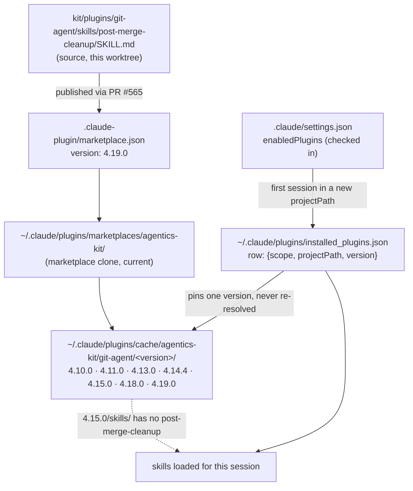

# Plugin version pinning across git worktrees

## At a glance

| Metric | Value |
|---|---|
| Repo changes | 0 (diagnostic session) |
| Files changed | 0 |
| Decisions | 4 |
| Open items | 5 |

`/git-agent:post-merge-cleanup` was reported broken. It is not broken — it was
never loaded. This worktree resolves `git-agent@agentics-kit` to **4.15.0** at
project scope, and the skill first shipped in **4.19.0** (`e1e8840`, PR #565).
The skill's own suite passes 28/28 against the worktree sources; no code was
changed, and the fix (`claude plugin update ... --scope project`) was left
unapplied pending the user's call on which remediation path to take.

**Diff budget:** opted in per the command, but there was nothing to spend it on.
Session mode with a clean tree — `git status --porcelain` empty, zero hunks.

## Architecture and code paths

The finding lives entirely in the plugin resolution chain. Nothing in
`kit/plugins/git-agent/` is implicated.



*Follow the `installed_plugins.json` row — it is the only thing that decides which cached version a directory sees.*

**What to read first, in order:**

1. `~/.claude/plugins/installed_plugins.json` — `plugins["git-agent@agentics-kit"]`
   is an **array**, one row per install site:
   `{scope, projectPath, installPath, version, installedAt, lastUpdated}`.
   A `scope: project` row shadows the `scope: user` row. This file is the
   authority; `~/.claude/plugins/config.json` is `{"repositories": {}}` and holds
   nothing relevant.
2. `.claude/settings.json:23` — `enabledPlugins` declares
   `"git-agent@agentics-kit": true`, alongside `extraKnownMarketplaces`. The file
   is **tracked in git**, so every worktree checkout carries it.
3. `~/.claude/plugins/cache/agentics-kit/git-agent/<version>/skills/` — the
   version-keyed cache, shared across all projects. `4.15.0/skills/` and
   `4.14.4/skills/` have no `post-merge-cleanup` directory; `4.19.0/skills/` does.

**The pin mechanism, four steps:**

1. `.claude/settings.json` lists the plugin and is checked in.
2. A new worktree is a full checkout at a new path — Claude Code treats each
   worktree path as a distinct `projectPath`.
3. The first session there reads `enabledPlugins`, resolves the plugin against
   the marketplace *as of that moment*, and writes a `scope: project` row with a
   concrete `version`.
4. That version is fixed. Nothing re-resolves it, and project scope shadows user
   scope — so a user-level 4.19.0 stays invisible in that directory.

Install timestamps confirm it: they track worktree creation, not plugin releases.

| Version | Installed | Path |
|---|---|---|
| 4.14.4 | 08-12 12:43 | `devbox/agentics` (main checkout) |
| 4.14.4 | 08-12 12:47 | `festive-clarke-e9f4a5` *(directory deleted)* |
| 4.15.0 | 08-12 17:01 | `build-proposal-refactor-da22e9` *(directory deleted)* |
| 4.15.0 | 08-14 18:44 | `insights-review-skill-ba0347` |
| 4.15.0 | 08-14 19:23 | `intelligent-dubinsky-b80fde` |
| 4.15.0 | 08-14 19:53 | `modest-elion-eff4c2` |
| 4.15.0 | 08-14 19:55 | `lucid-haslett-a66e8b` (this session) |

The user row moved to 4.19.0 on 08-16. No project row followed. 7 agentics rows,
21 project rows across all repos, 15 live worktrees.

## Decisions

**Diagnose, do not apply the fix.** `claude plugin update git-agent@agentics-kit
--scope project` was identified and handed back unrun. It mutates plugin config
outside the repo and requires a session restart to take effect either way, so
running it would have changed user state without making the result observable in
this session. The user asked why it was broken, not to fix it.

**Treat the session's own available-skills listing as primary evidence.** The
listing showed only `create-issue`, `merge`, and `ship-autonomous` from git-agent
— direct observation of what the runtime actually loaded, stronger than any
inference from source files. Cross-checked against `ls` on the version cache.

**Rule out `scope-guard.py` by reading it, not by running the skill.** The
PreToolUse hook added in `744f6e1` was the first suspect, since it sits in front
of every Bash call and post-merge-cleanup is a destructive-command skill.
`is_candidate()` (`kit/plugins/git-agent/hooks/scope-guard.py:139`) admits `git`
only when `git_args(tokens)[0] == "stash"`, so `git worktree remove` and
`git branch -d` never reach a rule. Ruled out without touching a worktree.

**Retract the first remediation recommendation.** The initial answer called
dropping project-scoped installs "the cheap answer" before reading what holds
them. `.claude/settings.json` turned out to be checked in, which makes that a
repo-visible change with consequences for cloners, not local bookkeeping. The
retraction was stated plainly rather than quietly amended.

## Tradeoffs and rejected options

Three remediation paths were laid out; none was chosen, because the choice turns
on a question only the user can answer — whether the checked-in `enabledPlugins`
list exists for them or for people cloning the repo.

**Per-worktree update on demand.** No repo change; recurring cost. Cheap per
instance — the version cache is shared, so an update rewrites a JSON pin and
downloads nothing.

```bash
claude plugin update git-agent@agentics-kit --scope project
```

**Drop `git-agent` from checked-in `enabledPlugins`.** Permanently fixes *new*
worktrees, which would inherit only the user-scoped install. Costs auto-enable on
a fresh clone — a real loss for a marketplace repo that partly exists to
dogfood its own plugins — and does nothing to the 7 rows already written. To
revisit: decide the audience of `enabledPlugins` first.

**Update the main checkout only.** Worktrees are short-lived; the main checkout
at 4.14.4 has been stale four versions and is the one that persists. Accepts that
worktrees stay stale by design.

## Learnings

**Tried and abandoned: the scope-guard hypothesis.** `744f6e1` had just added a
PreToolUse scope guard to git-agent, and "new hook + skill that shells out to
destructive git commands" was a tidier story than a version pin. Reading
`is_candidate()` killed it in one pass. Worth knowing the guard's actual blast
radius: repo-wide `--write`/`--fix` formatter runs, and `git stash pop|apply`
with no explicit ref. Nothing else.

**Tried and abandoned: the "systemic skill loading bug" read.** Five git-agent
skills were missing from the session listing — `branch-agent`, `commit-agent`,
`pr-agent`, `ship`, and `post-merge-cleanup` — which looked like a loader
failure. Four of them carry `disable-model-invocation: true` in frontmatter and
are user-invocable only, so their absence is correct. Only `post-merge-cleanup`,
which has no such flag, was signal. Checking frontmatter across all skills before
theorizing would have skipped this detour.

**Gotcha: a correct user-scoped install is not evidence the skill is available.**
User scope showed 4.19.0 with the skill present on disk the whole time. Scope
shadowing is silent — there is no warning that a project row is overriding a
newer user row.

**Gotcha: `installed_plugins.json` rows are never reaped.** Two of the seven
agentics rows point at worktree directories that no longer exist. Deleting a
worktree leaves its pin behind indefinitely.

**Gotcha: `~/.claude/plugins/config.json` is a dead end.** It reads
`{"repositories": {}}`. Install state lives in `installed_plugins.json`.

## Tests and verification

**Ran:** `tests/plugins/test-post-merge-cleanup.sh` → **28/28 pass** against the
worktree sources. This is what establishes the skill is not defective; the report
of "not working" would otherwise have been indistinguishable from a real bug.

**Verified by direct inspection:**

- `ls` on `cache/agentics-kit/git-agent/{4.14.4,4.15.0}/skills/` — no
  `post-merge-cleanup` directory. `4.19.0/skills/` has it, with matching
  frontmatter.
- `installed_plugins.json` parsed for every `git-agent@agentics-kit` row, with an
  `os.path.isdir` existence check per `projectPath`.
- `git ls-files --error-unmatch .claude/settings.json` — confirmed tracked.
- `claude plugin update --help` — confirmed `--scope user|project|local|managed`.

**Knowingly untested:**

- **The fix itself.** `claude plugin update ... --scope project` was never run.
  The claim that it makes the skill resolve after a restart is reasoned from the
  scope model, not observed.
- **The skill end-to-end.** Only its test suite ran. `post-merge-cleanup` has
  still never executed against a real merged branch and worktree in this session,
  which is the thing the original bug report was actually reaching for.

## Review follow-ups and tech debt

- **Main checkout is four versions stale.** `/Users/shawnsandy/devbox/agentics`
  pinned at 4.14.4 while HEAD ships 4.19.0. It is the long-lived directory, so it
  matters more than any worktree.
- **Open decision blocking remediation.** Is checked-in `enabledPlugins` for the
  maintainer or for cloners? Every path above depends on the answer.
- **No bulk update across worktrees.** `--scope project` acts on one cwd. With 15
  live worktrees there is no single command to move them all.
- **Stale rows accumulate.** Nothing prunes `installed_plugins.json` when a
  worktree is removed; 2 of 7 agentics rows are already orphaned.
- **Dogfooding ceiling on `post-merge-cleanup` itself.** The skill's job includes
  clearing merged worktrees, and this pin behaviour means it is least likely to
  be present in exactly the aging worktrees it was written to clean up. Upgrade
  path: if the skill is meant to be reachable everywhere, it belongs somewhere
  that is not per-project version-pinned.

## Files touched

**Repo source: none.** `git status --porcelain` was empty at the start and end of
the session. No plugin file, test, or config was modified.

**Read for diagnosis (unmodified):**

| Path | Why |
|---|---|
| `kit/plugins/git-agent/skills/post-merge-cleanup/SKILL.md` | Confirm the skill and its safety contract exist as shipped |
| `kit/plugins/git-agent/hooks/scope-guard.py` | Rule out the PreToolUse guard as the blocker |
| `.claude/settings.json` | Source of `enabledPlugins`; established it is checked in |
| `tests/plugins/test-post-merge-cleanup.sh` | Executed; 28/28 |

**Outside the repo (read only):** `~/.claude/plugins/installed_plugins.json`,
`~/.claude/plugins/config.json`, and the `cache/agentics-kit/git-agent/*/skills/`
version directories.

**Created:** this record.
