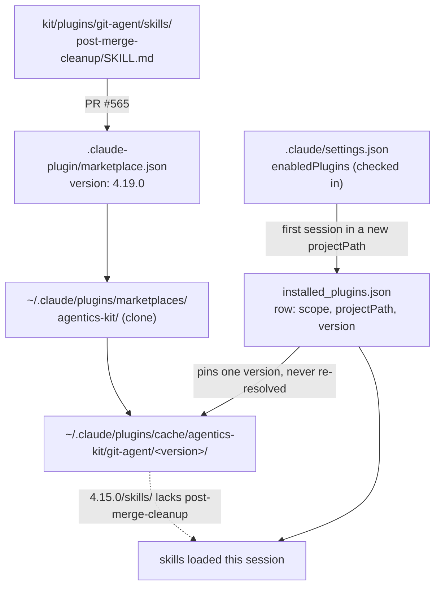
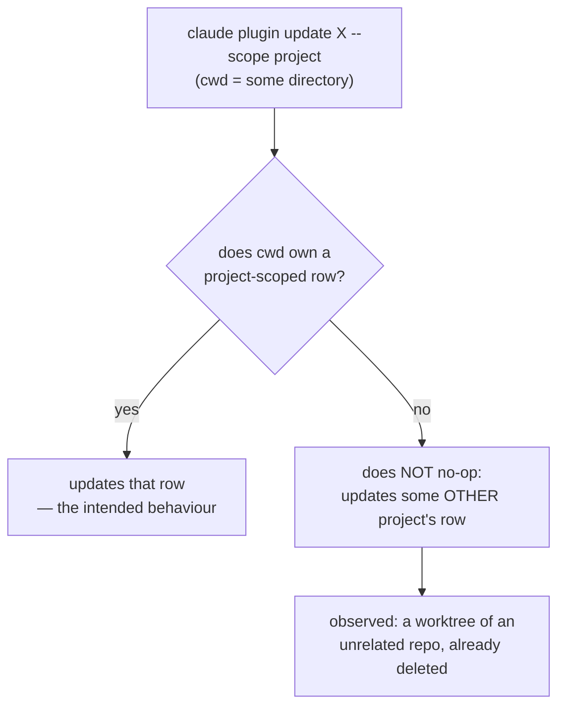

# Plugin version pinning across git worktrees

## At a glance

| Metric | Value |
|---|---|
| Files changed | 4 |
| Pins moved | 5 |
| Decisions | 8 |
| Open items | 5 |

`/git-agent:post-merge-cleanup` was reported broken. It was never loaded: this
worktree resolved `git-agent@agentics-kit` to 4.15.0 at project scope while the
skill first shipped in 4.19.0 (`e1e8840`, PR #565). The skill's own suite passes
28/28, so nothing under `kit/plugins/git-agent/` was at fault.

The session then applied the fix across every live agentics directory, and while
building a script to do it, found that `claude plugin update --scope project`
run from a directory with **no** project row does not no-op — it silently
updates some other project's row. That discovery is now the load-bearing
constraint in `scripts/update-worktree-plugins.sh`.

**Diff budget:** opted in. One file carries logic — `scripts/update-worktree-plugins.sh`
(4,026 bytes, untracked) — and was read in full. The three committed files are
generated or prose and were taken from their commit body.

## Architecture and code paths

Two mechanisms matter here. Neither lives in `kit/plugins/`.

### 1. How a skill name resolves to a file

*The `installed_plugins.json` row is the only thing deciding which cached version a directory sees.*

**Read first, in order:**

1. `~/.claude/plugins/installed_plugins.json` — `plugins["git-agent@agentics-kit"]`
   is an **array**, one row per install site:
   `{scope, projectPath, installPath, version, installedAt, lastUpdated}`.
   A `scope: project` row shadows the `scope: user` row, silently. This file is
   the authority; `~/.claude/plugins/config.json` is `{"repositories": {}}`.
2. `.claude/settings.json:23` — `enabledPlugins` names the plugin, and the file
   is **tracked in git**, so every worktree checkout carries it.
3. `~/.claude/plugins/cache/agentics-kit/git-agent/<version>/skills/` — the
   version-keyed cache, shared across projects, so an update is a pin rewrite
   with no download.

The pin happens once: a new worktree is a distinct `projectPath`, its first
session resolves the plugin *as of that moment*, writes a concrete `version`,
and nothing re-resolves it. Install timestamps track worktree creation, not
plugin releases.

### 2. The `--scope project` fall-through

*Why the script never enters a directory that has no row of its own.*

`scripts/update-worktree-plugins.sh` is built around that branch:

- `git worktree list --porcelain | awk '/^worktree /{print $2}'` enumerates live
  worktrees of *this* repo. Membership is tested by `os.path.realpath` identity,
  not a path substring, so a similarly-named checkout elsewhere is never swept in.
- An embedded `python3` heredoc filters `installed_plugins.json` to rows that are
  `scope == "project"`, whose `projectPath` still exists, and whose realpath is
  in the live set. Everything else is skipped — that is the guard.
- The loop `cd`s into each target because `claude plugin update` has no `--cwd`
  and no bulk form.
- Work list goes through a temp file, not `mapfile`: macOS ships bash 3.2.

## Decisions

**Diagnose before fixing, then fix when asked.** The first pass identified
`claude plugin update ... --scope project` and deliberately left it unrun — it
mutates config outside the repo and needs a restart regardless, and the ask was
"why is it broken", not "fix it". When the fix was requested it was applied to
all four live agentics directories.

**Treat the session's own available-skills listing as primary evidence.** It
showed only `create-issue`, `merge`, and `ship-autonomous` from git-agent —
direct observation of what the runtime loaded, stronger than inference from
source. Cross-checked with `ls` on the version cache.

**Rule out `scope-guard.py` by reading it, not by running the skill.** The
PreToolUse hook from `744f6e1` was the first suspect. `is_candidate()`
(`kit/plugins/git-agent/hooks/scope-guard.py:139`) admits `git` only when
`git_args(tokens)[0] == "stash"`, so `git worktree remove` never reaches a rule.

**Retract the first remediation recommendation.** Calling "drop the project-scoped
installs" the cheap answer preceded reading what holds them. `.claude/settings.json`
is checked in, making that a repo-visible change affecting cloners.

**Guard the script on has-a-row rather than trusting cwd.** The obvious design —
run the update in every live worktree and let the CLI no-op — is actively unsafe
given the fall-through. Only directories that already own a row are entered.

**Drop the version comparison from the script.** The first draft read the target
from the main checkout's `marketplace.json` and got 4.11.0 for a plugin at
4.19.0. Worktrees check out different refs, so no working-tree file states what
is current. `claude plugin update` resolves against the marketplace clone and
prints "already at the latest version", so it is the authority.

**Do not work around the `rm` denial.** Deleting the retired memory files is
blocked at the permission layer by the user's own global rule. `mv`,
`find -delete`, and `python3 os.remove` are the same delete in disguise; the
refusal was reported with the command to run instead.

**Keep the recap on one URL.** Both runs of `/artifact-tools:eng-recap` publish
through the `eng-artifact-url:` key in this record, so the shared link shows
current state rather than minting a second page.

## Tradeoffs and rejected options

**Three remediation paths, one chosen.** Per-worktree update on demand (no repo
change, recurring cost) was taken. Dropping `git-agent` from checked-in
`enabledPlugins` would permanently fix *new* worktrees but costs auto-enable on
a fresh clone — a real loss for a marketplace repo that dogfoods its own plugins
— and clears no existing rows. Updating only the main checkout was rejected once
the ask covered every worktree. To revisit the middle option: decide whether
`enabledPlugins` exists for the maintainer or for cloners.

**Script generality vs. one-off.** The scratchpad driver hardcoded
`devbox/agentics` and a `4.19.0` target. The committed version takes a
`plugin@marketplace` argument, derives worktrees from `git worktree list`, and
has no target constant — the cost is a `python3` heredoc instead of a `grep`.

**Filtering vs. running everywhere.** Running the update in all 15 live worktrees
is fewer lines and was tested first. Rejected outright once the fall-through
appeared: it would mutate unrelated repos.

**Committing the script into PR #566.** Left untracked. That PR is docs-only, and
folding a script in muddies the diff.

## Learnings

**Tried and abandoned — the scope-guard hypothesis.** "New PreToolUse hook +
destructive-command skill" was a tidier story than a version pin, and wrong.
Worth knowing the guard's real blast radius: repo-wide `--write`/`--fix`
formatter runs, and `git stash pop|apply` with no ref. Nothing else.

**Tried and abandoned — the systemic loader bug read.** Five git-agent skills
were missing from the listing. Four carry `disable-model-invocation: true` and
are user-invocable only, so their absence is correct; only `post-merge-cleanup`
was signal. Checking frontmatter across all skills first would have skipped it.

**Tried and abandoned — "just run the update everywhere".** Probing it updated
`devbox/513/.claude/worktrees/wire-dashboard-impact-grid-d56c80` (4.14.4 →
4.19.0), an already-deleted worktree in an unrelated repo. Practical harm nil,
but it is an unrequested change to another project, and it killed the simple
design.

**Gotcha — a correct user-scoped install is not evidence a skill is available.**
User scope was 4.19.0 with the file on disk the entire time. Scope shadowing is
silent: no warning that a project row overrides a newer user row.

**Gotcha — no working-tree file tells you the current plugin version.** Different
worktrees sit on different refs, so `marketplace.json` read from one of them is
whatever branch it happens to be on.

**Gotcha — macOS bash 3.2 has no `mapfile`.** The first driver died on it before
running anything, so no partial state.

**Gotcha — `installed_plugins.json` rows are never reaped.** Deleting a worktree
leaves its pin forever; 2 of 7 agentics rows and 9 of 15 in `devbox/513` are
orphans.

**Gotcha — a chat "yes" cannot lift a permission-layer denial.** `rm` is denied
outright by the user's global rules; re-asking in conversation does not reach
that layer.

## Tests and verification

**The fix is now verified — this corrects the first version of this recap,**
which listed it as reasoned-but-unobserved. All four live agentics directories
were updated and re-read from `installed_plugins.json`: **0 live rows remain
behind 4.19.0**, and the install path now resolving carries `post-merge-cleanup`
in `skills/`.

| Check | Result |
|---|---|
| `tests/plugins/test-post-merge-cleanup.sh` | 28/28 pass |
| Live agentics rows behind 4.19.0, after update | 0 (was 4) |
| `update-worktree-plugins.sh` — default, behind-plugin, no-rows, bad-flag | 4/4 behave; bad flag exits 2 |
| `bash -n` on the script | clean |
| Guard excludes worktrees without a pin | 15 live, 5 listed |
| `git ls-files --error-unmatch .claude/settings.json` | tracked |

**Knowingly untested:**

- **`post-merge-cleanup` end-to-end.** Only its suite ran. It has still never
  executed against a real merged branch and worktree — the thing the original
  report was reaching for.
- **The script's failure path.** `FAILED` counting and the non-zero exit were
  never exercised; every update in this session succeeded.
- **The script on a non-agentics repo.** Written to be generic, only run here.

## Review follow-ups and tech debt

- **Seven retired memory files still on disk.** Consolidation removed their index
  pointers, so they no longer load into context, but `rm` is denied at the
  permission layer. Command handed to the user.
- **Orphaned pin rows accumulate.** 2 in agentics, 9 in `devbox/513`, including
  the one this session touched by accident. Only `claude plugin uninstall` at
  that scope clears them; nothing prunes automatically.
- **`scripts/update-worktree-plugins.sh` is untracked** and has no test under
  `tests/`. It is the kind of script the repo would normally pin with one.
- **No upstream fix for the fall-through.** The guard is a workaround in one
  script; anyone running `claude plugin update --scope project` by hand from the
  wrong directory hits the same trap.
- **`post-merge-cleanup`'s dogfooding ceiling.** It clears merged worktrees, yet
  the pin behaviour makes it least likely to exist in the aging worktrees it was
  written for. Upgrade path: if it must be reachable everywhere, it belongs
  somewhere not per-project version-pinned.

## Files touched

**Committed** (`c85471f`, on [PR #566](https://github.com/shawn-sandy/agentics/pull/566)):

| Path | Why |
|---|---|
| `docs/plans/sessions/document-worktree-plugin-pinning-session.md` | This record; carries `eng-artifact-url:` |
| `docs/artifacts/eng-recap-2026-08-16.html` | Published recap, mermaid inlined as static SVG |
| `docs/artifacts/index.html` | Gallery index rebuilt by `build-artifacts-index.sh` |

**Untracked:**

| Path | Why |
|---|---|
| `scripts/update-worktree-plugins.sh` | Bulk pin update across worktrees, guarded on has-a-row |

**Read for diagnosis, unmodified:** `kit/plugins/git-agent/skills/post-merge-cleanup/SKILL.md`,
`kit/plugins/git-agent/hooks/scope-guard.py`, `kit/plugins/git-agent/skills/pr-agent/SKILL.md`,
`.claude/settings.json`, `tests/plugins/test-post-merge-cleanup.sh`.

**Outside the repo:** `installed_plugins.json` (5 rows moved — main, 3 worktrees,
1 unintended in `devbox/513`); the memory directory under
`~/.claude/projects/-Users-shawnsandy-devbox-agentics/memory/` (1 memory added,
`MEMORY.md` rewritten 58 → 55 lines, 7 files retired from the index but not yet
deleted).
