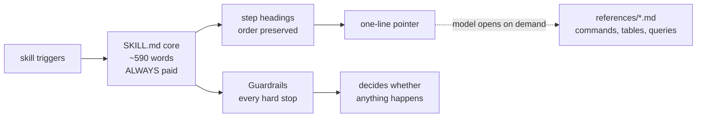

# Six monolithic skill bodies split into cores plus references

## At a glance

- **Changes shipped:** 6 skill cores split, 20 reference files added, 9 tests wired into CI (1 new, 8 that existed but ran nowhere)
- **Files touched:** 33 (13 modified, 20 added) — commit `e5fccc7`
- **Decisions made:** 6
- **Open items:** 3 (one blocking verification, two fragility notes)

Always-loaded context across the six targets dropped from **9,565 words to
3,536**. The three `git-agent` skills that rewrite refs and end in a squash merge
now cost 1,776 words instead of 5,073. Implemented per
`docs/plans/split-git-social-skills.md`, fanned out across six parallel
subagents. All four tests pass, and 15 of the plan's 16 acceptance criteria are
met. The sixteenth *is* the behavioural verification, left unchecked on purpose:
no skill here has been executed, so `status:` stayed `in-progress`.

## Architecture and code paths

A `SKILL.md` body has no partial load — the moment a skill's `description:`
matches, the entire body enters context. So the unit of optimisation is the
**core**, not the plugin directory. Content merely relocated under
`kit/plugins/` is not "moved out of context"; content moved behind a link the
model may never open is.

The layout follows two conventions already in the repo rather than inventing a
third:

- `kit/plugins/social-media-tools/skills/share-react/references/props-extraction.md`
  — skill-local, linked as ``Read `references/x.md` (bundled with this skill)``
- `kit/plugins/git-agent/skills/create-issue/references/` — same shape, git-agent side

Critically distinct from **plugin-level** `kit/plugins/social-media-tools/references/`
(8 files: `platforms.md`, `variables.md`, `copy-panels.md`,
`rendering-pipeline.md`, `saving-and-delivery.md`, `reuse-check.md`,
`language-map.md`, `social-config.md`), which eleven skills read. Those were left
byte-untouched; every new file is skill-local.

### What stays in a core vs. what moves

The load-bearing rule: **guards stay, procedure moves.** A guard is the
*statement* (`Never merge on anything but green`, `no-verify`,
`Cap autofix at 3 attempts per failing check`). Procedure is the *commands and
tables* that implement it — the `gh api graphql` review-thread query, the CI
failure classification table, the branch-name type-inference table, the
stash-pop recovery script.

Guards sit in the always-paid core; only procedure sits behind the dashed edge.

`ship-autonomous` needed a structural change to fit: inline guard prose bottomed
out around 700 words, so the core now leads with a `## Guardrails` block holding
all 22 negative imperatives, followed by every step heading (0, 1, 2, 2.5, 3, 4,
5, 6, 6a–6d, 7, 8) reduced to a pointer. Read that file first — it is the
template the other five follow.

### Test topology

`tests/plugins/test-skill-split-git-social.sh` is the objective gate, modelled on
`test-remaining-skill-splits.sh` from PR #487. Six checks: word ceiling,
reference placement, link integrity in **both** directions, descriptions pinned
to literal strings, guard retention per owning core, and plugin-level link counts
frozen at 7 / 8 / 11.

`test-ship-self-review.sh` was retargeted, not relaxed. It has 22 checks over
`ship/SKILL.md` and `agents/agent-ship.md`; Step 4.5's content moved, so checks
5–7 now read `ship/references/self-review.md` while the policy checks (2, 3, 4,
8, 9, 10) stay on the core. A new check 4.5 asserts the core actually links the
reference — a reference nothing links to never loads, and without that assertion
the retarget would pass against an orphan.

## Decisions

**Write the objective test before touching any skill.** A test written after a
refactor describes what the refactor happened to do rather than what it had to
do. Confirmed exit 1 naming all six skills over the ceiling with no `references/`
dir before the first split ran.

**Count words in Python, not `wc -w`.** Borrowed from
`test-remaining-skill-splits.sh`. These bodies are full of em dashes, `→`, and
`≤`; in the C locale a standalone `—` is not a word, in C.UTF-8 it is. That is a
~20-word swing per file — the difference between passing on a dev machine and
failing on a CI runner, which is the exact drift the test exists to prevent.

**Pin descriptions to literal strings in the test, not to a git diff.** The
`description:` is the sole trigger surface. Literal pinning works with no git
available and produces a diff of want-vs-got on failure; `git diff main` is kept
as a separate acceptance check.

**Assert the ceiling, not a delta from the plan's baselines.** The spec pins
2,448 / 1,863 / 1,515 / 1,414 / 1,284 / 1,234, but commits `745584e` and
`ce69bc8` had already trimmed these same bodies to 2,406 / 1,840 / 1,476 / 1,391
/ 1,261 / 1,191. Step 1's verify was unmeetable as written; the ceiling is the
real invariant.

**Fan out one subagent per skill, six concurrent.** The splits are independent —
disjoint file sets, no shared state. Each agent got the guard phrases it had to
retain verbatim, the exact reference filenames, and its own verification
commands. Main-loop context stayed at 41 tool calls because no 1,200–2,400-word
skill body was read into it.

**Leave `status: in-progress` despite 14/14 criteria passing.** The plan's
behavioural verification requires opening a real PR, pushing to the remote, and
an irreversible merge. Marking `completed` would assert verification that did not
happen.

## Tradeoffs and rejected options

**More reference files than the spec budgeted.** `share-explanation` needed 5
against the plan's 3; `share-session` needed 3 against 2. The fixed floor of a
core — frontmatter, phase-index table, plan-mode guard, scrub gate, ~12 phase
headings — is already ~450 words, so the 600-word ceiling and the plan's own
Files list were mutually unsatisfiable. Chose the ceiling, since that is what the
CI gate enforces. To revisit: raise the ceiling to ~750 and the spec's file list
becomes achievable.

**`ship` left at 599 of 600** *(superseded — now 571; see below)*. Trimming for headroom was considered and rejected
*for now*: that file carries 22 test assertions and every edit risks one. To
revisit: trim Step 3's rules list or the duplicated closing STOP block, then
re-run `test-ship-self-review.sh`.

**Every agent inherited `opus-5`.** Six agents at 100k–176k tokens each. The
mechanical splits would plausibly have run on a cheaper tier; the guard-retention
requirement argued against it for `ship-autonomous`, and uniformity was chosen
over per-agent tuning. Revisit by passing `model` per agent.

**`TEMPLATES_DIR` dedup left out of scope.** The same three-line
`find`/`CLAUDE_PLUGIN_ROOT` bootstrap appears verbatim in eleven
`social-media-tools` skills, ~70 words each. It touches eight skills this work
does not otherwise open; the spec routes it to Next Steps and that held.

## Learnings

**`git checkout --` on uncommitted work restores the *pre-change* file, not the
pre-mutation one.** This cost real work. The tautology checks mutate a file,
assert the test fails, then restore. Restoring with `git checkout -- <path>`
reverted `ship/SKILL.md` and `share-session/SKILL.md` to their **pre-split**
1,191- and 1,391-word state — the finished cores were never committed, so HEAD
had no copy of them. Both had to be rebuilt from their surviving reference files.

**Two of the four restores silently did nothing.** `git checkout -- <tracked>
<untracked>` errors on the unmatched pathspec and restores **neither** file. That
is why `ship-autonomous` came back at 583 words rather than 595 — it had kept the
tautology mutation (one guard line deleted), and `self-review.md` had kept its
deleted `Responsive` bullet. Both needed hand repair. The failure is quiet: the
error mentions the pathspec, not the fact that the whole operation was abandoned.

The working method: `cp` to the scratchpad, mutate, test, `cp` back. Applied on
the second pass, all four tautology checks ran clean.

**A line-filter delete leaves orphaned continuation lines.** Removing lines
matching `Responsive` from a wrapped Markdown bullet left
`breakpoint, srcset, width…` dangling under the *previous* item, which reads as
valid content. Same shape in the `ship-autonomous` guardrail — `with
--match-head-commit.` orphaned under the review bullet. Both looked like prose,
not corruption.

**Subagent token cost does not appear in the session's own ledger.**
`session_usage.py` reports 161k for this session; the eight subagents reported
~1.05M more in separate transcripts. Fan-out moved cost off the main-loop
accounting rather than reducing it — worth knowing before reading any
session-usage comparison as a cost measurement.

## Tests and verification

**Passing:**

| Gate | Result |
|---|---|
| `test-skill-split-git-social.sh` (new) | exit 0 — 6 checks |
| `test-ship-self-review.sh` (retargeted) | exit 0 — all 22 checks |
| `test-description-budget.sh` | exit 0 |
| `test-no-orphan-plugin-dirs.sh` | exit 0 |
| `BASE_REF=main node scripts/check-plugin-versions.mjs` | exit 0 |
| Acceptance criteria | 14 / 14 |

**Tautology check — four passes, each against a different assertion** so a single
lenient `grep` cannot hide:

1. +400 filler words in `ship/SKILL.md` → exit 1, `FAIL: ship(999)`
2. *Moving* (not deleting) the `Never merge on anything but green` line into
   `references/merge-gate.md` → exit 1, `lost guard`. This is the realistic
   failure mode, and the one a presence-anywhere check would miss.
3. One character in `share-session`'s `description:` → exit 1 with want/got diff
4. Deleting the `Responsive` bullet from `ship/references/self-review.md` →
   `test-ship-self-review.sh` exit 1

Clean exit 0 after each restore.

**Knowingly untested — the plan's behavioural check.** No skill was executed.
Word counts prove nothing about whether the skills still branch, ship, and
publish cards; that requires `claude --plugin-dir` sessions, a real branch and
PR, `ship-autonomous` against a deliberately failing lint script, and three
Playwright PNG renders. It is the single outstanding gate and the reason the plan
is not marked complete. A structural read-through of `ship-autonomous/SKILL.md`
was done as a partial substitute — guards up front, step order intact, each
pointer landing at the right reference — which is weaker evidence than a run.

## Review follow-ups and tech debt

**`ship/SKILL.md` at 599/600 words** *(resolved during review — now 571)*. Code
review found the split had moved `ship`'s CLI-auth hard stop out of the core;
restoring it needed words the file did not have, so Step 3's commit-message rules
moved to `references/commit-message.md`. That bought 28 words of headroom. The
ceiling still has no margin on the other five cores. Not a
ceiling with an upgrade path — a genuine cliff. Trim before editing.

**`share-explanation` at 596 and `share-session` at 597.** Same cliff, 4 and 3
words of headroom. Five of six cores sit within 7 words of the gate. Either budget
a real margin or raise the ceiling; as it stands, routine wording edits will
break the build.

**Behavioural verification outstanding.** Blocks marking the plan complete. Needs
a scratch branch and permission to open and close a PR.

**Next Steps from the spec, unstarted:** the eleven-skill `TEMPLATES_DIR` dedup,
and `git-agent/skills/merge/SKILL.md` — 1,156 words, no references, ends in an
irreversible squash merge. Both carry self-contained prompts in the plan.

## Files touched

**git-agent skills** — cores rewritten, guards retained in-core

- `skills/ship-autonomous/SKILL.md` — 2,406 → 597w; new `## Guardrails` block holds all 22 imperatives
- `skills/ship-autonomous/references/{preflight-and-verify,pr-events,ci-autofix,merge-gate}.md` — Step 1/2.5 commands, subscribe-vs-poll + triage + review handling, CI classification table, merge and branch-deletion sequences
- `skills/branch-agent/SKILL.md` — 1,476 → 582w; keeps the Step 1 guard trio, `--no-track`, no-retry/no-force
- `skills/branch-agent/references/{branch-naming,stash-and-recovery}.md` — name resolution and type inference, conflict detection and stash-pop recovery
- `skills/ship/SKILL.md` — 1,191 → 571w; keeps Step 1 guards, the `no-verify` prohibition, the CLI-auth hard stop, Step 4.5's four policy lines
- `skills/ship/references/{platform-clis,self-review,pr-body,commit-message}.md` — `gh`/`glab` detection and auth messages, the four regression checks and amend procedure, PR body template, conventional-commit format rules (`commit-message.md` added during review to fund restoring the CLI-auth guard)

**social-media-tools skills** — cores rewritten, scrub gate retained in-core

- `skills/share-explanation/SKILL.md` — 1,840 → 596w
- `skills/share-explanation/references/{target-resolution,synthesis-structure,card-population,bootstrap,copy-drafting}.md` — five-tier lookup, per-target section structures, escape order and variable tables, Phase 0 bootstrap, platform copy guidance
- `skills/share-session/SKILL.md` — 1,391 → 597w
- `skills/share-session/references/{session-data,card-population,draft-copy}.md` — Phase 1a–1e gathering, escape order and card variables, per-platform recap formats
- `skills/share-selection/SKILL.md` — 1,261 → 593w
- `skills/share-selection/references/{selection-sources,card-population}.md` — source precedence and file guards, template pick and diff/snippet variable tables

**Tests and CI**

- `tests/plugins/test-skill-split-git-social.sh` (new) — the objective gate
- `tests/plugins/test-ship-self-review.sh` — checks 5–7 retargeted to the reference, new check 4.5 asserts the link
- `.github/workflows/check-plugin-versions.yml` — one step after "Test gallery index merge driver"

**Metadata**

- `.claude-plugin/marketplace.json` — git-agent 4.7.1 → 4.8.0, social-media-tools 2.19.2 → 2.20.0
- `kit/plugins/git-agent/CHANGELOG.md`, `kit/plugins/social-media-tools/CHANGELOG.md` — v4.8.0 and v2.20.0 entries with before/after counts
- `docs/plans/split-git-social-skills.md` — 14 criteria ticked, `status: in-progress`, `modified: 2026-07-30`
- `docs/plans/split-git-social-skills.html` — re-rendered by `scripts/build-plan-html.mjs`
